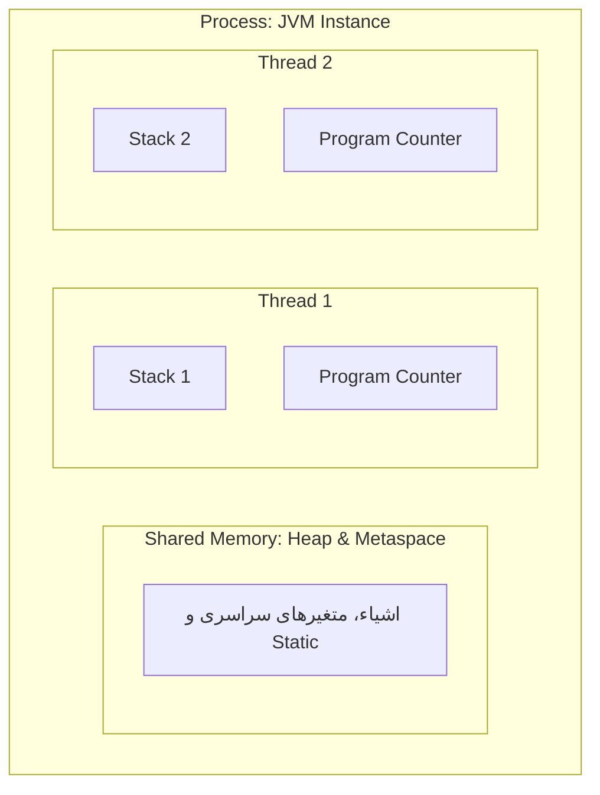
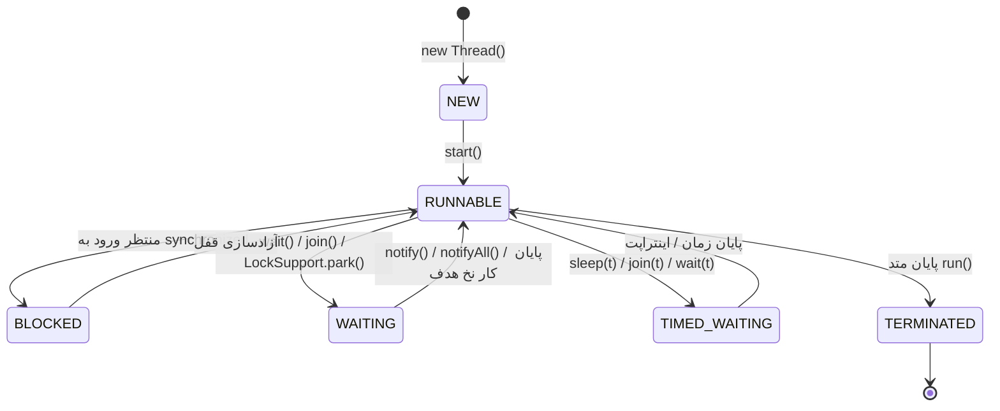
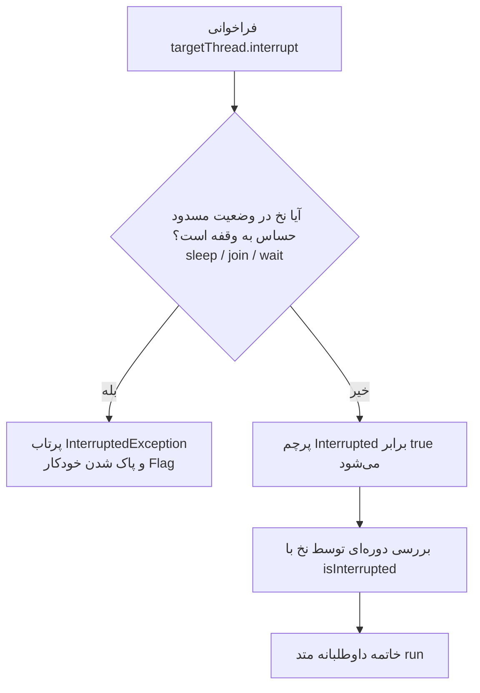
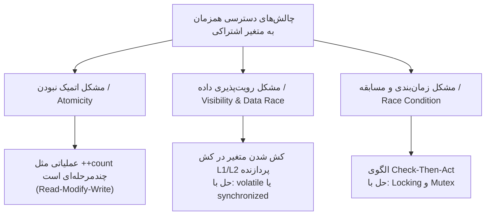
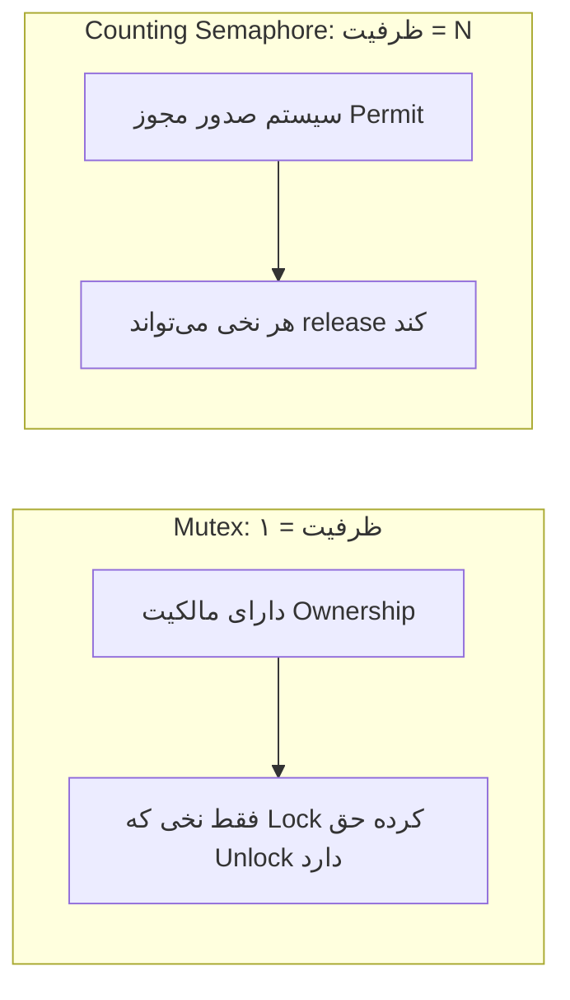
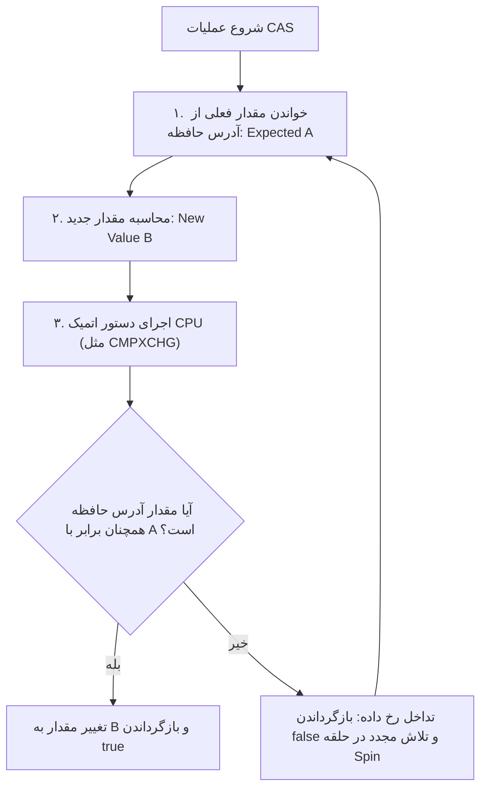

# جزوه جامع همزمانی (Concurrency) و چندنخی در جاوا

> [!summary] تعریف کوتاه
> **Concurrency (همزمانی)** به قابلیت اجرای چندین وظیفه یا جریان کاری به‌صورت همپوشان یا مستقل از یکدیگر در برنامه گفته می‌شود.  
> جاوا از طریق پکیج‌های پایه‌ای (`java.lang.Thread`) و پکیج قدرتمند `java.util.concurrent` (معروف به JUC)، سطوح مختلفی از همزمانی مبتنی بر Thread، ساختارهای قفل‌گذاری (Locking)، استخرهای نخ (Executor Framework) و الگوریتم‌های بدون قفل (Lock-Free) را ارائه می‌دهد.

---

## فهرست مطالب

- [[#مفاهیم بنیادی: Process در برابر Thread]]
- [[#راه‌های ساخت و اجرای Thread در جاوا]]
- [[#مدیریت چرخه عمر و کنترل نخ‌ها]]
  - [[#متد join]]
  - [[#نخ‌های پس‌زمینه (Daemon Threads)]]
  - [[#مکانیزم توقف و Interruption]]
- [[#مدیریت نخ‌ها با Executor Framework]]
  - [[#انواع استخرهای نخ (ThreadPools)]]
  - [[#رابط Callable و Future]]
  - [[#زمان‌بندی با ScheduledExecutorService]]
- [[#چالش‌های همزمانی و مدیریت حافظه]]
  - [[#مشکل Atomic نبودن عملیات]]
  - [[#تداخل حافظه (Data Race) و قابلیت رویت (Visibility)]]
  - [[#تداخل منطقی (Race Condition)]]
- [[#انحصار متقابل (Mutex) و مکانیزم‌های قفل‌گذاری]]
  - [[#قفل ضمنی: کلمه کلیدی synchronized]]
  - [[#قفل صریح: ReentrantLock]]
  - [[#تفاوت Mutex و Semaphore]]
- [[#خطرات همزمانی: Deadlock، Livelock و Starvation]]
- [[#مجموعه‌های Thread-Safe و Collections]]
  - [[#مشکل Iterator در synchronizedList]]
  - [[#جایگزین‌های مدرن (CopyOnWriteArrayList و ConcurrentHashMap)]]
- [[#الگوریتم‌های بدون قفل (Lock-Free) و مکانیزم CAS]]
  - [[#نحوه کارکرد Compare-And-Swap]]
  - [[#کلاس‌های پکیج java.util.concurrent.atomic]]
  - [[#مشکل ABA و راه‌حل آن]]
- [[#جدول مقایسه رویکردهای همزمانی]]
- [[#جمع‌بندی]]

---

# مفاهیم بنیادی: Process در برابر Thread

در سطح سیستم‌عامل و JVM، تمایز میان پردازه و نخ پایه و اساس همزمانی است:



- **Process (پردازه):** یک برنامهٔ در حال اجرا با فضای آدرس‌دهی حافظهٔ کاملاً مستقل و ایزوله. هر پروسه منابع اختصاصی خود را از سیستم‌عامل دریافت می‌کند.
- **Thread (نخ):** کوچک‌ترین واحد قابل زمان‌بندی توسط CPU. نخ‌ها درون یک پردازه ایجاد می‌شوند و **فضای Heap یکسانی را به اشتراک می‌گذارند**، اما هر نخ دارای **Stack و Program Counter (PC) اختصاصی** خود است.

---

# راه‌های ساخت و اجرای Thread در جاوا

برای ایجاد نخ در جاوا چندین روش با الگوهای مختلف وجود دارد:

### ۱. ارث‌بری از کلاس `Thread`
کلاس ما متد `run()` را Override می‌کند و با فراخوانی متد `start()`، نخ در سطح سیستم‌عامل آماده‌به‌کار می‌شود:

```java
public class WorkerThread extends Thread {
    @Override
    public void run() {
        System.out.println("نخ در حال اجراست: " + Thread.currentThread().getName());
    }
}

// نحوه اجرا:
WorkerThread t1 = new WorkerThread();
t1.start(); // هرگز run() را مستقیم صدا نزنید!
```

> [!danger] هشدار مهم: تفاوت `start()` و `run()`
> صدا زدن مستقیم `t1.run()` باعث می‌شود کد درون همان نخی که صدا زده شده (مثلاً `main`) اجرا شود و هیچ نخ جدیدی ساخته **نمی‌شود**. متد `start()` است که به JVM دستور ساخت نخ مستقل را می‌دهد.

---

### ۲. پیاده‌سازی رابط `Runnable`
رویکرد ترجیحی و اصولی‌تر، تفکیک وظیفه (*Task*) از مکانیزم اجرا (*Execution Mechanism*) است:

```java
// پیاده‌سازی کلاسیک
public class TaskRunner implements Runnable {
    @Override
    public void run() {
        System.out.println("Task اجرا شد.");
    }
}

Thread t2 = new Thread(new TaskRunner());
t2.start();

// استفاده از کلاس ناشناس (Anonymous Class)
Thread t3 = new Thread(new Runnable() {
    @Override
    public void run() {
        System.out.println("اجرا در Anonymous Class");
    }
});
t3.start();

// استفاده از عبارت لامبدا (Lambda) - سبک‌ترین و خواناترین روش
Thread t4 = new Thread(() -> System.out.println("اجرا با Lambda Expression"));
t4.start();
```

---

# مدیریت چرخه عمر و کنترل نخ‌ها



---

## متد `join`

وقتی نخی روی شیء نخ دیگر متد `join()` را فراخوانی می‌کند، تا زمان ا {
        Thread.sleep(1500);
        System.out.println("محاسبات پس‌زمینه تکمیل شد.");
    } catch (InterruptedException e) {
        Thread.currentThread().interrupt();
     نخ فراخوان حداکثر تا سقف میلی‌ثانیهٔ مشخص‌شده معطل می‌ماند و پس از آن در صورت تمام نشدن نخ هدف، به کار خود ادامه می‌دهد.

```java
Thread computation = new Thread(() -> {
    try {
        Thread.sleep(1500);
        System.out.println("محاسبات پس‌زمینه تکمیل شد.");
    } catch (InterruptedException e) {
        Thread.currentThread().interrupt();
    }
});

computation.start();
System.out.println("نخ اصلی منتظر اتمام محاسبات می‌ماند...");

computation.join(); // ترد main اینجا مسدود می‌شود

System.out.println("نخ اصلی: حالا می‌توانیم داده را دریافت کنیم.");
```

---

## نخ‌های پس‌زمینه (Daemon Threads)

نخ‌ها در جاوا به دو دستهٔ **User Thread** و **Daemon Thread** تقسیم می‌شوند:

- JVM تا زمانی که حداقل **یک User Thread زنده** باشد، برنامه را متوقف نمی‌کند.
- اگر تمامی User Threadها به پایان برسند، JVM فوراً خاتمه یافته و **همهٔ Daemon Threadها بی‌درنگ متوقف می‌شوند** (بدون اجرای کدهای بعدی یا `finally`).

```java
Thread backgroundCleaner = new Thread(() -> {
    while (true) {
        // انجام عملیات پاک‌سازی کش
    }
});

// تعیین نوع نخ به عنوان دیمن پیش از start
backgroundCleaner.setDaemon(true);
backgroundCleaner.setName("Cleaner-Daemon");
backgroundCleaner.start();

// بررسی دیمن بودن
boolean isDaemon = backgroundCleaner.isDaemon(); // true
```

---

## مکانیزم توقف و Interruption

متد قدیمی `stop()` به دلیل آزاد کردن ناگهانی قفل‌ها و فساد وضعیت درونی داده‌ها، سال‌هاست منسوخ شده است.  
توقف در جاوا مبتنی بر **همکاری داوطلبانه (Cooperative Cancellation)** با استفاده از پرچم وقفه (*Interrupted Flag*) است:



### بررسی وضعیت وقفه در کد:
1. **`Thread.interrupted()` (استاتیک):** وضعیت پرچم وقفهٔ نخ جاری را بررسی کرده و بلافاصله آن را `false` (پاک) می‌کند.
2. **`isInterrupted()` (نمونه):** وضعیت پرچم وقفه را بدون تغییر دادن آن بازمی‌گرداند.

```java
public class GracefulWorker extends Thread {
    @Override
    public void run() {
        while (!isInterrupted()) {
            try {
                // کارهای محاسباتی
                Thread.sleep(500); // متد حساس به وقفه
            } catch (InterruptedException e) {
                System.out.println("وقفه حین خواب رخ داد. پاک‌سازی منابع و خروج...");
                // بازگرداندن وضعیت وقفه در صورت نیاز به اعلام به لایه‌های بالاتر:
                Thread.currentThread().interrupt();
                break; // خروج ایمن از حلقه
            }
        }
        System.out.println("نخ به سلامت متوقف شد.");
    }
}
```

---

# مدیریت نخ‌ها با Executor Framework

ساخت دستی نخ به ازای هر تسک، هزینهٔ بالایی در ایجاد، تخصیص حافظه Stack و Context Switch تحمیل می‌کند.  
از Java 5 به بعد، فریم‌ورک `Executor` مدیریت و استفاده مجدد از نخ‌ها (*Thread Pooling*) را بر عهده گرفته است.

```java
import java.util.concurrent.ExecutorService;
import java.util.concurrent.Executors;

ExecutorService executor = Executors.newFixedThreadPool(4);

for (int i = 0; i < 10; i++) {
    final int taskId = i;
    executor.submit(() -> {
        System.out.println("Task " + taskId + " توسط " + Thread.currentThread().getName());
    });
}

// بستن استخر نخ پس از اتمام ارجاع کارها
executor.shutdown();
```

---

## انواع استخرهای نخ (ThreadPools)

| متد سازنده در `Executors` | رفتار و مشخصات | مورد کاربرد |
|---|---|---|
| `newFixedThreadPool(n)` | دارای تعداد ثابت $n$ نخ و یک صف تسک نامحدود (`LinkedBlockingQueue`). | پردازش بارهای کاری پایدار و قابل پیش‌بینی. |
| `newCachedThreadPool()` | بدون سقف نخ، در صورت نیاز نخ جدید می‌سازد و نخ‌های بیکار را پس از ۶۰ ثانیه حذف می‌کند. | تسک‌های متعدد با طول عمر بسیار کوتاه و I/O-Bound. |
| `newSingleThreadExecutor()` | فقط با ۱ نخ کار می‌کند و تسک‌ها را دقیقاً به ترتیب ورود (FIFO) اجرا می‌کند. | اجرای تسک‌های متوالی که تداخل با یکدیگر دارند. |
| `newScheduledThreadPool(core)` | استخری مجهز به قابلیت اجرای با تأخیر یا دوره‌ای تسک‌ها. | کارهای زمان‌بندی‌شده دوره‌ای (Heartbeat، لاگ دوره‌ای). |

> [!warning] نکتهٔ طراحی مقیاس‌پذیر در محیط واقعی
> در کدهای Production، استفاده مستقیم از توابع کارخانه‌ای `Executors` به‌دلیل داشتن صف‌های تسک نامحدود (*Unbounded Queues*) ممکن است منجر به `OutOfMemoryError` شود. پیشنهاد می‌شود مستقیماً از سازنده کلاس `ThreadPoolExecutor` با صف‌های با ظرفیت معین (`ArrayBlockingQueue`) و سیاست‌های رد تسک (*Rejection Policies*) استفاده شود.

---

## رابط `Callable` و `Future`

رابط `Runnable` خروجی برنمی‌گرداند و امکان پرتاب Checked Exception ندارد. در مقابل، `Callable<V>` مقداری از نوع $V$ برمی‌گرداند و می‌تواند Exception پرتاب کند.

نتیجهٔ یک فراخوانی غیرهمگام در قالب شیء `Future<V>` مدیریت می‌شود:

```java
import java.util.concurrent.*;

public class FutureExample {
    public static void main(String[] args) throws ExecutionException, InterruptedException, TimeoutException {
        ExecutorService service = Executors.newCachedThreadPool();

        Callable<String> orderTask = () -> {
            Thread.sleep(2000);
            return "سفارش با شناسه #9823 آماده شد.";
        };

        // ارسال تسک به استخر نخ
        Future<String> future = service.submit(orderTask);

        // انجام کارهای دیگر در نخ جاری بدون معطلی:
        while (!future.isDone()) {
            System.out.println("نخ اصلی: در حال پردازش موارد دیگر...");
            Thread.sleep(500);
        }

        // دریافت نتیجه (بلاک‌کننده تا زمان آماده شدن خروجی)
        // پیشنهاد می‌شود حتماً زمان Timeout مشخص شود:
        String result = future.get(5, TimeUnit.SECONDS);
        System.out.println("دریافت نتیجه: " + result);

        service.shutdown();
    }
}
```

---

## زمان‌بندی با `ScheduledExecutorService`

```java
import java.util.concurrent.*;

ScheduledExecutorService scheduler = Executors.newScheduledThreadPool(1);

Runnable heartbeat = () -> System.out.println("Heartbeat ارسال شد: " + System.currentTimeMillis());

// اجرای دوره‌ای: شروع با تاخیر ۲ ثانیه، تکرار هر ۱ ثانیه یک‌بار
scheduler.scheduleAtFixedRate(heartbeat, 2, 1, TimeUnit.SECONDS);
```

---

# چالش‌های همزمانی و مدیریت حافظه

وقتی چندین نخ به‌طور همزمان به منابع اشتراکی دسترسی پیدا می‌کنند، سه مشکل اصلی ساختاری رخ می‌دهد:



---

## ۱. مشکل Atomic نبودن عملیات
یک عمل به ظاهر ساده مثل `count++` در سطح سخت‌افزار شامل سه دستور مستقل است:
1. خواندن مقدار فعلی از حافظه (`LOAD`)
2. افزایش یک واحد به مقدار (`INCREMENT`)
3. نوشتن مقدار جدید در حافظه (`STORE`)

اگر وسط این سه گام، سیستم‌عامل تعویض زمینه (*Context Switch*) انجام دهد، داده تغییریافته توسط نخ دیگر بازنویسی شده و به‌اصطلاح **Lost Update** رخ می‌دهد.

---

## ۲. تداخل حافظه (Data Race) و قابلیت رویت (Visibility)
هر هستهٔ CPU دارای کش حافظه اختصاصی (L1/L2) است. هنگامی که یک نخ متغیری را تغییر می‌دهد، ممکن است این تغییر بلافاصله در حافظه اصلی (RAM) نوشته نشود و سایر نخ‌ها روی هسته‌های دیگر همچنان مقدار قدیمی را از کش خود بخوانند.

- **راه حل:** استفاده از کلمه کلیدی `volatile` که تضمین می‌کند متغیر همواره مستقیماً از حافظهٔ اصلی خوانده و درون آن نوشته می‌شود (**تضمین Visibility و رابطه Happens-Before**).

> [!important]
> متغیر `volatile` مسئلهٔ رویت‌پذیری (*Visibility*) را حل می‌کند، اما **عملیات چندمرحله‌ای (مانند `++count`) را Atomic نمی‌کند.**

---

## ۳. تداخل منطقی (Race Condition)
زمانی رخ می‌دهد که صحت خروجی برنامه به **ترتیب زمانی یا همپوشانی تصادفی** اجرای نخ‌ها وابسته باشد.

- **مثال بارز: الگوی Check-then-Act (بررسی و سپس اقدام)**
```java
// کد غیر ایمن (Non-Thread-Safe)
if (balance >= amount) {      // ۱. بررسی
    balance -= amount;        // ۲. اقدام (برداشت)
}
```
اگر دو نخ همزمان شرط `if` را بررسی کنند و سپس وارد بدنه شوند، موجودی منفی خواهد شد.

---

# انحصار متقابل (Mutex) و مکانیزم‌های قفل‌گذاری

**Mutex (Mutual Exclusion)** مکانیزمی است که تضمین می‌کند در هر لحظه حداکثر یک نخ می‌تواند وارد ناحیه حساس (*Critical Section*) شود.

---

## روش اول: کلمه کلیدی `synchronized` (قفل ضمنی / Intrinsic Lock)

هر شیء در جاوا دارای یک قفل درونی به نام **Monitor Lock** است.

```java
public class ThreadSafeCounter {
    private int count = 0;

    // قفل شدن روی شیء this
    public synchronized void increment() {
        count++;
    }

    // یا استفاده از بلوک synchronized با هدف قفل اختصاصی:
    private final Object lock = new Object();

    public void decrement() {
        synchronized (lock) {
            count--;
        }
    }
}
```

- **مزیت:** استفاده آسان، آزادسازی خودکار قفل حتی در صورت بروز Exception.
- **محدودیت:** انعطاف‌پذیری کم، عدم امکان تعیین Timeout، عدم امکان وقفه در انتظار قفل.

---

## روش دوم: استفاده از `ReentrantLock` (قفل صریح)

کلاسی قدرتمند از پکیج `java.util.concurrent.locks` که قابلیت‌های پیشرفته‌تری نسبت به `synchronized` ارائه می‌دهد:

```java
import java.util.concurrent.locks.ReentrantLock;

public class AdvancedAccount {
    private double balance = 1000;
    // فعال‌سازی Fairness (ترتیب عادلانه براساس صف انتظار)
    private final ReentrantLock lock = new ReentrantLock(true);

    public void withdraw(double amount) {
        lock.lock(); // قفل کردن صریح
        try {
            if (balance >= amount) {
                balance -= amount;
            }
        } finally {
            lock.unlock(); // حتماً در بلوک finally باید آزاد شود!
        }
    }
}
```

### ویژگی‌های متمایز `ReentrantLock`:
1. **`tryLock(timeout, unit)`:** تلاش برای دریافت قفل بدون مسدود شدن دائمی نخ در صورت در دسترس نبودن.
2. **`lockInterruptibly()`:** امکان خروج نخ از صف انتظار قفل با ارسال سیگنال `interrupt()`.
3. **عدالت (Fairness Policy):** تخصیص قفل به نخی که طولانی‌ترین زمان را منتظر مانده است.

---

## تفاوت Mutex و Semaphore



---

# خطرات همزمانی: Deadlock، Livelock و Starvation

| وضعیت بحرانی | شرح و علت رخداد | راهکار مقابله |
|---|---|---|
| **Deadlock (بن‌بست)** | دو یا چند نخ برای منابعی که توسط دیگری قفل شده در انتظار ابدی می‌مانند. | رعایت **ترتیب یکنواخت در گرفتن قفل‌ها**، استفاده از `tryLock` با Timeout. |
| **Livelock (بن‌بست پویا)** | نخ‌ها فعال هستند و وضعیت خود را تغییر می‌دهند اما هیچ پیشرفت واقعی در کار ایجاد نمی‌شود. | اضافه‌کردن مکث تصادفی (*Randomized Backoff*) قبل از تلاش مجدد. |
| **Starvation (گرسنگی)** | یک نخ به دلیل اولویت پایین یا غصب مداوم منابع توسط سایر نخ‌ها هرگز فرصت اجرا پیدا نمی‌کند. | استفاده از قفل‌های عادلانه (*Fair Locks*) و عدم دستکاری نادرست اولویت نخ‌ها (`setPriority`). |

### نمونه کلاسیک بن‌بست (Deadlock):
```java
// ترد ۱: lock1 را می‌گیرد و منتظر lock2 می‌ماند.
// ترد ۲: lock2 را می‌گیرد و منتظر lock1 می‌ماند.
// نتیجه: Deadlock ابدی!
```

---

# مجموعه‌های Thread-Safe و Collections

اکثر مجموعه‌های استاندارد جاوا (`ArrayList`, `HashMap`) برای عملکرد تک‌نخی طراحی شده و Thread-Safe نیستند.

---

## متد `Collections.synchronizedList` و معضل Iterator

این کلاس کالکشن را درون یک Wrapper قفل‌دار قرار می‌دهد که تک‌تک متدها را `synchronized` می‌کند.

> [!danger] مشکل حیاتی در پیمایش (`Iteration`)
> متدهای منفرد مثل `add()` به صورت ایزوله ایمن هستند، اما حین حلقه `for-each` یا کار با `Iterator`، قفل روی کل پروسه نگه داشته نمی‌شود. اگر همزمان نخ دیگری عنصری اضافه کند، خطای `ConcurrentModificationException` رخ می‌دهد.

**حل مشکل پیمایش در `synchronizedList`:**
```java
List<String> syncList = Collections.synchronizedList(new ArrayList<>());

// پیمایش حتماً باید درون بلوک synchronized باشد:
synchronized (syncList) {
    for (String item : syncList) {
        System.out.println(item);
    }
}
```

---

## جایگزین‌های مدرن و مقیاس‌پذیر در JUC

1. **`CopyOnWriteArrayList`:**  
   در هر بار نوشتن/ویرایش، یک آرایه جدید در حافظه کپی و جایگزین می‌شود.  
   - **مزیت:** خواندن کاملاً بدون قفل و فوق‌العاده سریع است؛ Iterator هرگز با تداخل مواجه نمی‌شود.  
   - **کاربرد:** سناریوهایی که **حجم خواندن (Read) بسیار بالا و نوشتن (Write) بسیار اندک** است.

2. **`ConcurrentHashMap`:**  
   به‌جای قفل کردن کل نقشه، از مکانیزم **Lock Striping / قفل روی سطوح گره‌ها و عملیات CAS** استفاده می‌کند تا چند نخ بتوانند همزمان بدون مسدود شدن روی Bucketهای مختلف عملیات نوشتن و خواندن انجام دهند.

---

# الگوریتم‌های بدون قفل (Lock-Free) و مکانیزم CAS

رویکرد سنتی قفل‌گذاری یک روش **بدبینانه (Pessimistic)** است (فرض بر وقوع تداخل).  
رویکرد **خوش‌بینانه (Optimistic)** فرض می‌کند تداخلی نیست و از دستورات اتمیک سخت‌افزاری پردازنده استفاده می‌کند.



---

## پیاده‌سازی سخت‌افزاری: `CMPXCHG`
در معماری x86 پردازنده‌ها، این عملیات با دستور اسمبلی `CMPXCHG` همراه با پیشوند `LOCK` در سطح گذرگاه حافظه به‌صورت صددرصد Atomic اجرا می‌شود.

---

## کلاس‌های پکیج `java.util.concurrent.atomic`

کلاس‌هایی نظیر `AtomicInteger`، `AtomicLong` و `AtomicReference` بدون استفاده از قفل و با استفاده از CAS بالاترین عملکرد را ثبت می‌کنند:

```java
import java.util.concurrent.atomic.AtomicInteger;

public class OptimisticCounter {
    private final AtomicInteger counter = new AtomicInteger(0);

    public void increment() {
        // حلقه خودکار CAS تا زمان ثبت موفق
        counter.incrementAndGet();
    }

    public boolean manualCompareAndSet(int expected, int newValue) {
        return counter.compareAndSet(expected, newValue);
    }
}
```

---

## پدیدهٔ ABA و راه‌حل آن

- **سناریو:**
  1. نخ ۱ مقدار $A$ را می‌خواند.
  2. نخ ۲ مقدار را به $B$ و سپس مجدداً به $A$ تغییر می‌دهد.
  3. نخ ۱ مقدار را چک می‌کند؛ مقدار همچنان $A$ است و گمان می‌کند تغییری رخ نداده است (در حالی که تاریخچه تغییر کرده است).

- **راه حل در جاوا:** استفاده از کلاس `AtomicStampedReference<T>` که علاوه بر خود مقدار، یک شماره نسخه یا برچسب زمانی (*Stamp/Version*) را نیز در مقایسه دخالت می‌دهد:

```java
import java.util.concurrent.atomic.AtomicStampedReference;

String initialRef = "A";
int initialStamp = 1;

AtomicStampedReference<String> stampedRef = 
    new AtomicStampedReference<>(initialRef, initialStamp);

// مقایسه همزمان مقدار و نسخه:
boolean updated = stampedRef.compareAndSet("A", "B", 1, 2);
```

---

# جدول مقایسه رویکردهای همزمانی

| تکنیک / ابزار | نوع کنترل | هزینه Context Switch | قابلیت مقیاس‌پذیری | ریسک اصلی |
|---|---|---|---|---|
| `synchronized` | قفل‌گذاری بدبینانه ضمنی | متوسط تا بالا | متوسط | افت کارایی در ترافیک بالا |
| `ReentrantLock` | قفل‌گذاری بدبینانه صریح | متوسط | بالا | Deadlock در صورت عدم آزادسازی |
| `volatile` | تضمین رویت‌پذیری حافظه | صفر (بدون بلاک) | بسیار بالا | عدم پشتیبانی از اتمیسیته مرکب |
| `Atomic* (CAS)` | خوش‌بینانه و بدون قفل | صفر (Spinning) | فوق‌العاده بالا | مصرف بالای CPU در تداخل‌های سنگین |
| `Concurrent Collections` | ترکیبی (CAS + Fine-grained Lock) | بسیار کم | فوق‌العاده بالا | مصرف حافظه بیشتر |

---

# جمع‌بندی

1. **انتخاب رویکرد ساخت نخ:** در پروژه‌های مدرن به‌جای مدیریت مستقیم `Thread`، همواره از `ExecutorService` استفاده کنید.
2. **انتخاب ابزار Synchronization:**
   - برای وظایف شمارشی و متغیرهای ساده: پکیج `java.util.concurrent.atomic`.
   - برای پرچم‌های وضعیت ساده تک‌مرحله‌ای: `volatile`.
   - برای نواحی حساس پیچیده: `synchronized` یا در صورت نیاز به امکانات پیشرفته (Fairness/Timeout) از `ReentrantLock`.
3. **مجموعه‌ها:** در محیط‌های چندنخی به جای همگام‌سازی دستی، از ساختارهای آماده پکیج `java.util.concurrent` مانند `ConcurrentHashMap` و `CopyOnWriteArrayList` استفاده کنید.

> [!quote]
> هدف برنامه‌نویسی همزمان صرفاً اجرای همزمان کدها نیست؛ بلکه تضمین سلامت داده‌ها، پرهیز از بن‌بست و استفاده بهینه از منابع پردازشی بدون هدررفت عملکرد سیستم است.