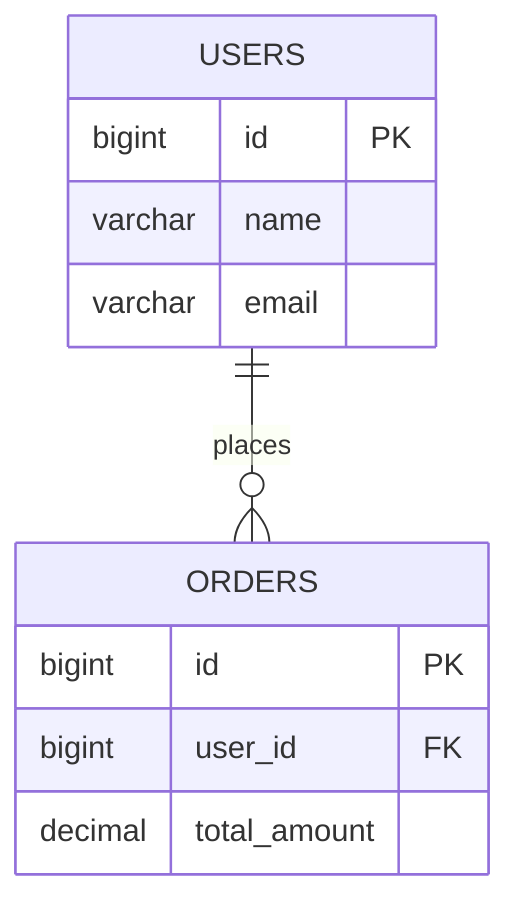
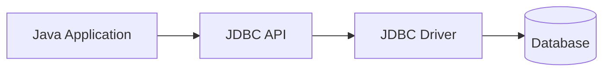
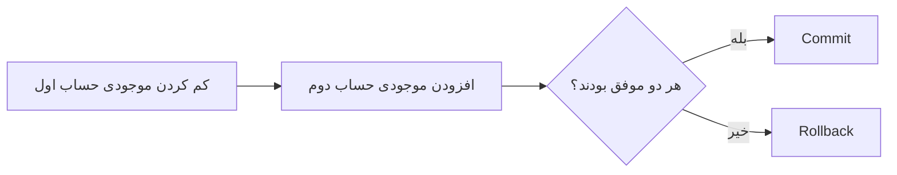
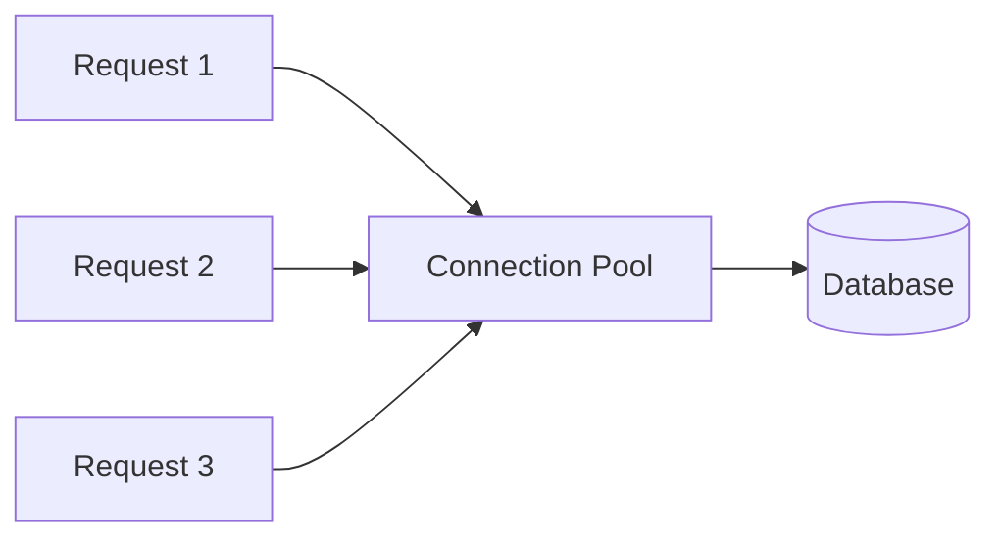
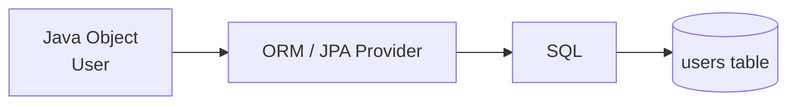

نننبل
# جزوه جامع دیتابیس در جاوا: JDBC، SQL و ORM

> [!summary] تعریف
> برنامه‌های جاوا برای نگهداری پایدار داده‌ها—مانند کاربران، سفارش‌ها، محصولات، پیام‌ها و گزارش‌ها—معمولاً با یک **پایگاه داده** ارتباط برقرار می‌کنند.
>
> دو رویکرد مهم در جاوا عبارت‌اند از:
>
> 1. **JDBC**: اجرای مستقیم SQL با کنترل کامل.
> 2. **ORM / JPA / Hibernate**: نگاشت Objectهای جاوا به جدول‌های دیتابیس.

---

## فهرست مطالب

- [[#مفاهیم اولیه دیتابیس]]
- [[#JDBC چیست]]
- [[#اجزای اصلی JDBC]]
- [[#راه‌اندازی MySQL و Driver]]
- [[#اتصال به دیتابیس]]
- [[#خواندن داده با SELECT]]
- [[#نوشتن داده با INSERT]]
- [[#به‌روزرسانی داده با UPDATE]]
- [[#حذف داده با DELETE]]
- [[#Statement در برابر PreparedStatement]]
- [[#جلوگیری از SQL Injection]]
- [[#ResultSet و پردازش نتیجه]]
- [[#Transaction در JDBC]]
- [[#Connection Pool]]
- [[#ORM چیست]]
- [[#JPA و Hibernate]]
- [[#نمونه CRUD با Hibernate]]
- [[#JDBC در برابر ORM]]
- [[#بهترین شیوه‌ها]]
- [[#جمع‌بندی]]

---

# مفاهیم اولیه دیتابیس

## دیتابیس چیست؟

**Database** یا پایگاه داده، سیستمی برای ذخیره‌سازی، سازمان‌دهی، جست‌وجو و مدیریت داده‌ها است.

نمونه‌هایی از اطلاعاتی که در دیتابیس ذخیره می‌شوند:

- اطلاعات کاربران
- محصولات فروشگاه
- سفارش‌ها و پرداخت‌ها
- پیام‌ها و اعلان‌ها
- گزارش‌ها و لاگ‌های ساخت‌یافته
- نقش‌ها و سطح دسترسی کاربران

در دیتابیس رابطه‌ای (*Relational Database*)، داده‌ها معمولاً در **Table**ها ذخیره می‌شوند.

مثال جدول `users`:

| id | name | email |
|---:|---|---|
| 1 | Ali Ahmadi | ali@example.com |
| 2 | Sara Mohammadi | sara@example.com |



---

## CRUD چیست؟

چهار عملیات پایه روی داده‌ها با نام **CRUD** شناخته می‌شوند:

| عملیات | SQL | توضیح |
|---|---|---|
| Create | `INSERT` | ایجاد رکورد جدید |
| Read | `SELECT` | خواندن داده |
| Update | `UPDATE` | به‌روزرسانی داده |
| Delete | `DELETE` | حذف داده |

---

# JDBC چیست؟

**JDBC** مخفف **Java Database Connectivity** است.

JDBC یک API استاندارد در جاوا برای اتصال به دیتابیس‌ها و اجرای دستورهای SQL است. این API در پکیج `java.sql` قرار دارد و با دیتابیس‌های مختلفی کار می‌کند؛ به شرط آن‌که Driver سازگار JDBC برای آن دیتابیس وجود داشته باشد.



نمونه دیتابیس‌های قابل استفاده با JDBC:

| دیتابیس | نمونه JDBC URL |
|---|---|
| MySQL | `jdbc:mysql://localhost:3306/testdb` |
| PostgreSQL | `jdbc:postgresql://localhost:5432/testdb` |
| H2 | `jdbc:h2:mem:testdb` |
| SQLite | `jdbc:sqlite:application.db` |
| Oracle | `jdbc:oracle:thin:@localhost:1521:xe` |
| SQL Server | `jdbc:sqlserver://localhost:1433;databaseName=testdb` |

> [!important]
> JDBC یک API است، نه Driver.  
> برای اتصال واقعی به MySQL، PostgreSQL یا هر دیتابیس دیگر، باید Driver همان دیتابیس را به پروژه اضافه کنید.

---

# اجزای اصلی JDBC

| جزء | نوع | مسئولیت |
|---|---|---|
| `DriverManager` | Class | پیداکردن Driver مناسب و ایجاد Connection |
| `Connection` | Interface | نماینده ارتباط فعال با دیتابیس |
| `Statement` | Interface | اجرای SQL ساده و بدون پارامتر |
| `PreparedStatement` | Interface | اجرای SQL پارامتردار و امن‌تر |
| `CallableStatement` | Interface | فراخوانی Stored Procedure |
| `ResultSet` | Interface | نگهداری نتیجه `SELECT` |
| `SQLException` | Exception | خطاهای مرتبط با SQL و دیتابیس |

---

# راه‌اندازی MySQL و Driver

## وابستگی Maven برای MySQL

در پروژه Maven، Driver مربوط به MySQL را به فایل `pom.xml` اضافه کنید:

```xml
<dependency>
    <groupId>com.mysql</groupId>
    <artifactId>mysql-connector-j</artifactId>
    <version>8.4.0</version>
</dependency>
```

## وابستگی Gradle

```gradle
dependencies {
    implementation("com.mysql:mysql-connector-j:8.4.0")
}
```

> [!note]
> درایورهای JDBC جدید معمولاً به‌صورت خودکار با Service Provider Mechanism بارگذاری می‌شوند. بنابراین در بیشتر پروژه‌های مدرن، فراخوانی دستی `Class.forName(...)` ضروری نیست؛ هرچند همچنان در برخی نمونه‌های آموزشی یا محیط‌های قدیمی دیده می‌شود.

بارگذاری دستی درایور MySQL:

```java
Class.forName("com.mysql.cj.jdbc.Driver");
```

---

# ایجاد جدول نمونه

برای اجرای مثال‌های بعدی، یک دیتابیس و جدول ساده بسازید:

```sql
CREATE DATABASE testdb
    CHARACTER SET utf8mb4
    COLLATE utf8mb4_unicode_ci;

USE testdb;

CREATE TABLE users (
    id BIGINT PRIMARY KEY AUTO_INCREMENT,
    name VARCHAR(100) NOT NULL,
    email VARCHAR(255) NOT NULL UNIQUE,
    created_at TIMESTAMP NOT NULL DEFAULT CURRENT_TIMESTAMP
);
```

> [!tip]
> برای ذخیره صحیح متن فارسی و Emoji در MySQL، معمولاً `utf8mb4` انتخاب مناسب‌تری است.

---

# اتصال به دیتابیس

## ساخت Connection

```java
import java.sql.Connection;
import java.sql.DriverManager;
import java.sql.SQLException;

public class DatabaseConnectionExample {

    public static void main(String[] args) {
        String url = "jdbc:mysql://localhost:3306/testdb";
        String username = "root";
        String password = "your-password";

        try (Connection connection =
                     DriverManager.getConnection(url, username, password)) {

            System.out.println("Connected: " + !connection.isClosed());

        } catch (SQLException exception) {
            exception.printStackTrace();
        }
    }
}
```

> [!important]
> `Connection` یک منبع محدود و گران‌قیمت است. همیشه آن را با `try-with-resources` ببندید؛ در برنامه‌های واقعی نیز معمولاً Connection Pool این وظیفه را مدیریت می‌کند.

---

# خواندن داده با SELECT

## مثال با `Statement`

```java
import java.sql.Connection;
import java.sql.DriverManager;
import java.sql.ResultSet;
import java.sql.SQLException;
import java.sql.Statement;

public class SelectWithStatement {

    public static void main(String[] args) {
        String url = "jdbc:mysql://localhost:3306/testdb";
        String username = "root";
        String password = "your-password";

        String sql = "SELECT id, name, email FROM users";

        try (
            Connection connection =
                    DriverManager.getConnection(url, username, password);

            Statement statement = connection.createStatement();

            ResultSet resultSet = statement.executeQuery(sql)
        ) {
            while (resultSet.next()) {
                long id = resultSet.getLong("id");
                String name = resultSet.getString("name");
                String email = resultSet.getString("email");

                System.out.printf(
                        "id=%d, name=%s, email=%s%n",
                        id,
                        name,
                        email
                );
            }

        } catch (SQLException exception) {
            exception.printStackTrace();
        }
    }
}
```

---

## `ResultSet` چگونه کار می‌کند؟

`ResultSet` نشان‌دهنده نتیجهٔ یک `SELECT` است. Cursor آن در ابتدا **قبل از اولین ردیف** قرار دارد.

```text
Before first row
       ↓
Row 1
       ↓
Row 2
       ↓
...
       ↓
After last row
```

با هر فراخوانی `resultSet.next()`، Cursor یک ردیف حرکت می‌کند:

```java
while (resultSet.next()) {
    String name = resultSet.getString("name");
}
```

دریافت داده بر اساس نام ستون:

```java
String email = resultSet.getString("email");
```

دریافت داده بر اساس شماره ستون:

```java
String email = resultSet.getString(3);
```

> [!tip]
> استفاده از نام ستون خواناتر و در برابر تغییر ترتیب ستون‌ها مقاوم‌تر است.

---

# نوشتن داده با INSERT

برای عملیات‌هایی که ResultSet بازنمی‌گردانند، مانند `INSERT`، `UPDATE` و `DELETE`، از `executeUpdate()` استفاده می‌کنیم.

```java
import java.sql.Connection;
import java.sql.DriverManager;
import java.sql.PreparedStatement;
import java.sql.SQLException;

public class InsertUserExample {

    public static void main(String[] args) {
        String url = "jdbc:mysql://localhost:3306/testdb";
        String username = "root";
        String password = "your-password";

        String sql = """
                INSERT INTO users (name, email)
                VALUES (?, ?)
                """;

        try (
            Connection connection =
                    DriverManager.getConnection(url, username, password);

            PreparedStatement statement =
                    connection.prepareStatement(sql)
        ) {
            statement.setString(1, "Ali Ahmadi");
            statement.setString(2, "ali@example.com");

            int affectedRows = statement.executeUpdate();

            System.out.println(affectedRows + " row inserted.");

        } catch (SQLException exception) {
            exception.printStackTrace();
        }
    }
}
```

خروجی `executeUpdate()` تعداد ردیف‌های تغییرکرده را برمی‌گرداند:

```java
int affectedRows = statement.executeUpdate();
```

---

## دریافت کلید تولیدشده

اگر ستون `id` از نوع `AUTO_INCREMENT` باشد، می‌توان کلید تولیدشده را دریافت کرد.

```java
import java.sql.Connection;
import java.sql.DriverManager;
import java.sql.PreparedStatement;
import java.sql.ResultSet;
import java.sql.SQLException;
import java.sql.Statement;

public class InsertAndReadGeneratedId {

    public static void main(String[] args) {
        String sql = """
                INSERT INTO users (name, email)
                VALUES (?, ?)
                """;

        try (
            Connection connection = DriverManager.getConnection(
                    "jdbc:mysql://localhost:3306/testdb",
                    "root",
                    "your-password"
            );

            PreparedStatement statement = connection.prepareStatement(
                    sql,
                    Statement.RETURN_GENERATED_KEYS
            )
        ) {
            statement.setString(1, "Sara Mohammadi");
            statement.setString(2, "sara@example.com");

            statement.executeUpdate();

            try (ResultSet keys = statement.getGeneratedKeys()) {
                if (keys.next()) {
                    long generatedId = keys.getLong(1);

                    System.out.println("Generated id: " + generatedId);
                }
            }

        } catch (SQLException exception) {
            exception.printStackTrace();
        }
    }
}
```

---

# به‌روزرسانی داده با UPDATE

```java
import java.sql.Connection;
import java.sql.DriverManager;
import java.sql.PreparedStatement;
import java.sql.SQLException;

public class UpdateUserExample {

    public static void main(String[] args) {
        String sql = """
                UPDATE users
                SET name = ?, email = ?
                WHERE id = ?
                """;

        try (
            Connection connection = DriverManager.getConnection(
                    "jdbc:mysql://localhost:3306/testdb",
                    "root",
                    "your-password"
            );

            PreparedStatement statement =
                    connection.prepareStatement(sql)
        ) {
            statement.setString(1, "New Name");
            statement.setString(2, "new.email@example.com");
            statement.setLong(3, 1L);

            int affectedRows = statement.executeUpdate();

            System.out.println(affectedRows + " row(s) updated.");

        } catch (SQLException exception) {
            exception.printStackTrace();
        }
    }
}
```

> [!warning]
> فراموش‌کردن `WHERE` در `UPDATE` می‌تواند همه ردیف‌های جدول را تغییر دهد.
>
> ```sql
> UPDATE users SET name = 'Unknown';
> ```
>
> قبل از اجرای Queryهای مخرب، SQL را با دقت بررسی کنید.

---

# حذف داده با DELETE

```java
import java.sql.Connection;
import java.sql.DriverManager;
import java.sql.PreparedStatement;
import java.sql.SQLException;

public class DeleteUserExample {

    public static void main(String[] args) {
        String sql = "DELETE FROM users WHERE id = ?";

        try (
            Connection connection = DriverManager.getConnection(
                    "jdbc:mysql://localhost:3306/testdb",
                    "root",
                    "your-password"
            );

            PreparedStatement statement =
                    connection.prepareStatement(sql)
        ) {
            statement.setLong(1, 1L);

            int affectedRows = statement.executeUpdate();

            System.out.println(affectedRows + " row(s) deleted.");

        } catch (SQLException exception) {
            exception.printStackTrace();
        }
    }
}
```

> [!danger]
> دستور زیر همه رکوردهای جدول را حذف می‌کند:
>
> ```sql
> DELETE FROM users;
> ```
>
> حذف داده در محیط Production باید با کنترل دسترسی، Backup، Transaction و بررسی دقیق انجام شود.

---

# `Statement` در برابر `PreparedStatement`

## Statement

`Statement` برای SQL ثابت و بدون ورودی خارجی قابل استفاده است:

```java
Statement statement = connection.createStatement();

ResultSet resultSet = statement.executeQuery(
        "SELECT id, name, email FROM users"
);
```

---

## PreparedStatement

`PreparedStatement` برای SQL پارامتردار استفاده می‌شود:

```java
String sql = "SELECT id, name, email FROM users WHERE email = ?";

PreparedStatement statement = connection.prepareStatement(sql);

statement.setString(1, "ali@example.com");
```

مزایای اصلی:

- جلوگیری از SQL Injection
- خوانایی بیشتر SQL
- جداسازی داده از دستور SQL
- امکان استفاده مجدد از Query
- در بسیاری از دیتابیس‌ها، بهینه‌سازی بهتر اجرای Queryهای تکراری

---

# جلوگیری از SQL Injection

## نمونه ناامن

```java
String email = userInput;

String sql = """
        SELECT id, name, email
        FROM users
        WHERE email = '%s'
        """.formatted(email);

Statement statement = connection.createStatement();

ResultSet resultSet = statement.executeQuery(sql);
```

اگر ورودی کاربر مخرب باشد، Query ممکن است تغییر کند.

نمونه ورودی مخرب:

```text
' OR '1'='1
```

---

## روش امن با PreparedStatement

```java
String sql = """
        SELECT id, name, email
        FROM users
        WHERE email = ?
        """;

try (PreparedStatement statement =
             connection.prepareStatement(sql)) {

    statement.setString(1, userInput);

    try (ResultSet resultSet = statement.executeQuery()) {
        // پردازش نتیجه
    }
}
```

> [!important]
> علامت `?` فقط برای **مقدار داده‌ها** است، نه نام جدول، نام ستون یا کلمات کلیدی SQL.
>
> این کد نامعتبر است:
>
> ```java
> String sql = "SELECT * FROM ?";
> ```
>
> اگر نام جدول یا ستون پویا است، باید آن را از یک فهرست سفید (*Allowlist*) اعتبارسنجی کنید.

---

# CallableStatement و Stored Procedure

برای فراخوانی Stored Procedure از `CallableStatement` استفاده می‌شود.

فرض کنید Procedure زیر در دیتابیس وجود دارد:

```sql
CALL find_user_by_id(1);
```

نمونه جاوا:

```java
import java.sql.CallableStatement;
import java.sql.Connection;
import java.sql.DriverManager;
import java.sql.ResultSet;

public class CallableStatementExample {

    public static void main(String[] args) {
        String sql = "{CALL find_user_by_id(?)}";

        try (
            Connection connection = DriverManager.getConnection(
                    "jdbc:mysql://localhost:3306/testdb",
                    "root",
                    "your-password"
            );

            CallableStatement statement =
                    connection.prepareCall(sql)
        ) {
            statement.setLong(1, 1L);

            boolean hasResultSet = statement.execute();

            if (hasResultSet) {
                try (ResultSet resultSet = statement.getResultSet()) {
                    while (resultSet.next()) {
                        System.out.println(
                                resultSet.getString("name")
                        );
                    }
                }
            }

        } catch (Exception exception) {
            exception.printStackTrace();
        }
    }
}
```

---

# Transaction در JDBC

## Transaction چیست؟

**Transaction** گروهی از عملیات دیتابیسی است که باید به‌صورت یک واحد انجام شود:

- یا همه عملیات با موفقیت ثبت شوند: **Commit**
- یا در صورت خطا همه تغییرات بازگردند: **Rollback**

مثال: انتقال وجه بین دو حساب



---

## نمونه Transaction

```java
import java.math.BigDecimal;
import java.sql.Connection;
import java.sql.DriverManager;
import java.sql.PreparedStatement;
import java.sql.SQLException;

public class MoneyTransferExample {

    public static void main(String[] args) {
        String withdrawSql = """
                UPDATE accounts
                SET balance = balance - ?
                WHERE id = ? AND balance >= ?
                """;

        String depositSql = """
                UPDATE accounts
                SET balance = balance + ?
                WHERE id = ?
                """;

        BigDecimal amount = new BigDecimal("100.00");

        try (Connection connection = DriverManager.getConnection(
                "jdbc:mysql://localhost:3306/testdb",
                "root",
                "your-password"
        )) {
            connection.setAutoCommit(false);

            try (
                PreparedStatement withdraw =
                        connection.prepareStatement(withdrawSql);

                PreparedStatement deposit =
                        connection.prepareStatement(depositSql)
            ) {
                withdraw.setBigDecimal(1, amount);
                withdraw.setLong(2, 1L);
                withdraw.setBigDecimal(3, amount);

                int withdrawnRows = withdraw.executeUpdate();

                if (withdrawnRows != 1) {
                    throw new IllegalStateException(
                            "Insufficient balance or invalid source account."
                    );
                }

                deposit.setBigDecimal(1, amount);
                deposit.setLong(2, 2L);

                int depositedRows = deposit.executeUpdate();

                if (depositedRows != 1) {
                    throw new IllegalStateException(
                            "Destination account was not found."
                    );
                }

                connection.commit();

                System.out.println("Transfer completed.");

            } catch (Exception exception) {
                connection.rollback();

                System.err.println("Transfer rolled back.");
                exception.printStackTrace();
            }

        } catch (SQLException exception) {
            exception.printStackTrace();
        }
    }
}
```

> [!important]
> در JDBC، `autoCommit` به‌صورت پیش‌فرض فعال است. یعنی هر Query تغییر‌دهنده، به‌طور مستقل Commit می‌شود.
>
> برای اجرای چند عملیات وابسته در یک Transaction:
>
> ```java
> connection.setAutoCommit(false);
> ```

---

# Connection Pool

بازکردن Connection جدید برای هر درخواست هزینه‌بر است. در برنامه‌های وب و سرویس‌های پرترافیک، از **Connection Pool** استفاده می‌شود.



Pool مجموعه‌ای از Connectionهای آماده نگه می‌دارد:

1. برنامه یک Connection از Pool می‌گیرد.
2. عملیات دیتابیس را انجام می‌دهد.
3. Connection را `close()` می‌کند.
4. Connection در واقع به Pool برگردانده می‌شود، نه این‌که لزوماً اتصال فیزیکی قطع شود.

کتابخانه رایج برای این کار:

- **HikariCP**

نمونه پیکربندی مفهومی:

```java
HikariConfig config = new HikariConfig();

config.setJdbcUrl("jdbc:mysql://localhost:3306/testdb");
config.setUsername("app_user");
config.setPassword("secure-password");
config.setMaximumPoolSize(10);

DataSource dataSource = new HikariDataSource(config);
```

> [!warning]
> حتی هنگام استفاده از Connection Pool، باید Connection را با `try-with-resources` ببندید. این کار باعث بازگشت درست آن به Pool می‌شود.

---

# ORM چیست؟

**ORM** مخفف **Object-Relational Mapping** است.

ORM لایه‌ای بین Objectهای جاوا و جدول‌های دیتابیس ایجاد می‌کند:



نگاشت ساده:

| Object Java | جدول دیتابیس |
|---|---|
| `User` | `users` |
| فیلد `id` | ستون `id` |
| فیلد `name` | ستون `name` |
| فیلد `email` | ستون `email` |

نمونهٔ یک Entity:

```java
User user = new User(
        "Ali Ahmadi",
        "ali@example.com"
);
```

این Object می‌تواند توسط ORM به SQL تبدیل شود:

```sql
INSERT INTO users (name, email)
VALUES ('Ali Ahmadi', 'ali@example.com');
```

---

# JPA و Hibernate

## تفاوت JPA و Hibernate

| مورد | JPA | Hibernate |
|---|---|---|
| ماهیت | Specification / استاندارد | ORM Framework |
| پکیج رایج جدید | `jakarta.persistence` | `org.hibernate` |
| نقش | تعریف API و رفتار استاندارد | یکی از پیاده‌سازی‌های JPA |
| وابستگی به دیتابیس | ندارد | از طریق Dialect و Driver پشتیبانی می‌کند |

> [!note]
> **JPA یک استاندارد است** و **Hibernate یکی از پیاده‌سازی‌های معروف آن** است.  
> در پروژه‌های مدرن، معمولاً Annotationهای JPA از `jakarta.persistence` استفاده می‌شوند، نه `javax.persistence`.

---

## وابستگی‌های نمونه Maven

```xml
<dependencies>
    <dependency>
        <groupId>org.hibernate.orm</groupId>
        <artifactId>hibernate-core</artifactId>
        <version>6.6.0.Final</version>
    </dependency>

    <dependency>
        <groupId>com.mysql</groupId>
        <artifactId>mysql-connector-j</artifactId>
        <version>8.4.0</version>
        <scope>runtime</scope>
    </dependency>
</dependencies>
```

---

# تعریف Entity با JPA

```java
package com.example;

import jakarta.persistence.Column;
import jakarta.persistence.Entity;
import jakarta.persistence.GeneratedValue;
import jakarta.persistence.GenerationType;
import jakarta.persistence.Id;
import jakarta.persistence.Table;

@Entity
@Table(name = "users")
public class User {

    @Id
    @GeneratedValue(strategy = GenerationType.IDENTITY)
    private Long id;

    @Column(nullable = false, length = 100)
    private String name;

    @Column(nullable = false, unique = true, length = 255)
    private String email;

    protected User() {
        // Required by JPA
    }

    public User(String name, String email) {
        this.name = name;
        this.email = email;
    }

    public Long getId() {
        return id;
    }

    public String getName() {
        return name;
    }

    public String getEmail() {
        return email;
    }

    public void changeName(String name) {
        this.name = name;
    }

    public void changeEmail(String email) {
        this.email = email;
    }
}
```

---

# پیکربندی Hibernate

در پروژه‌های جدید می‌توان پیکربندی را با کد یا `persistence.xml` انجام داد. نمونهٔ زیر یک پیکربندی XML آموزشی است:

```xml
<?xml version="1.0" encoding="UTF-8"?>
<!DOCTYPE hibernate-configuration PUBLIC
        "-//Hibernate/Hibernate Configuration DTD 3.0//EN"
        "https://hibernate.org/dtd/hibernate-configuration-3.0.dtd">

<hibernate-configuration>
    <session-factory>
        <property name="hibernate.connection.driver_class">
            com.mysql.cj.jdbc.Driver
        </property>

        <property name="hibernate.connection.url">
            jdbc:mysql://localhost:3306/testdb
        </property>

        <property name="hibernate.connection.username">
            root
        </property>

        <property name="hibernate.connection.password">
            your-password
        </property>

        <property name="hibernate.dialect">
            org.hibernate.dialect.MySQLDialect
        </property>

        <property name="hibernate.hbm2ddl.auto">
            validate
        </property>

        <property name="hibernate.show_sql">
            true
        </property>

        <mapping class="com.example.User"/>
    </session-factory>
</hibernate-configuration>
```

## گزینه‌های مهم `hbm2ddl.auto`

| مقدار | رفتار |
|---|---|
| `validate` | فقط تطابق Entity و Schema را بررسی می‌کند |
| `update` | سعی می‌کند Schema را به‌روزرسانی کند |
| `create` | Schema را هنگام شروع می‌سازد |
| `create-drop` | هنگام شروع می‌سازد و هنگام پایان حذف می‌کند |
| `none` | هیچ تغییری اعمال نمی‌کند |

> [!danger]
> در محیط Production از `create` یا `create-drop` استفاده نکنید؛ ممکن است داده‌ها یا ساختار دیتابیس از بین بروند.  
> برای Migrationهای واقعی از ابزارهایی مانند **Flyway** یا **Liquibase** استفاده کنید.

---

# نمونه CRUD با Hibernate

## ایجاد و ذخیره کاربر

```java
package com.example;

import org.hibernate.Session;
import org.hibernate.SessionFactory;
import org.hibernate.Transaction;
import org.hibernate.cfg.Configuration;

public class HibernateCreateExample {

    public static void main(String[] args) {
        try (SessionFactory sessionFactory =
                     new Configuration()
                             .configure()
                             .addAnnotatedClass(User.class)
                             .buildSessionFactory()) {

            try (Session session = sessionFactory.openSession()) {
                Transaction transaction = session.beginTransaction();

                User user = new User(
                        "John Doe",
                        "john.doe@example.com"
                );

                session.persist(user);

                transaction.commit();

                System.out.println("Generated id: " + user.getId());
            }
        }
    }
}
```

---

## خواندن کاربر

```java
try (Session session = sessionFactory.openSession()) {
    User user = session.find(User.class, 1L);

    if (user != null) {
        System.out.println(user.getName());
    }
}
```

---

## به‌روزرسانی کاربر

در Entityهای مدیریت‌شده، Hibernate تغییرات را هنگام Commit تشخیص می‌دهد. به این فرایند **Dirty Checking** گفته می‌شود.

```java
try (Session session = sessionFactory.openSession()) {
    Transaction transaction = session.beginTransaction();

    User user = session.find(User.class, 1L);

    if (user != null) {
        user.changeName("Updated Name");
        user.changeEmail("updated@example.com");
    }

    transaction.commit();
}
```

---

## حذف کاربر

```java
try (Session session = sessionFactory.openSession()) {
    Transaction transaction = session.beginTransaction();

    User user = session.find(User.class, 1L);

    if (user != null) {
        session.remove(user);
    }

    transaction.commit();
}
```

---

# JDBC در برابر ORM

| معیار | JDBC | ORM / Hibernate |
|---|---|---|
| کنترل SQL | بسیار زیاد | کمتر، اما قابل تنظیم |
| نیاز به نوشتن SQL | زیاد | کمتر |
| شروع یادگیری | ساده‌تر | مفاهیم بیشتر دارد |
| Mapping داده‌ها | دستی | خودکار یا Annotationمحور |
| Queryهای پیچیده | مناسب و شفاف | گاهی پیچیده‌تر |
| جلوگیری از Boilerplate | کمتر | بیشتر |
| مناسب برای | گزارش، Queryهای دقیق، ابزارهای سبک | اپلیکیشن‌های دامنه‌محور و CRUD |
| Performance | قابل کنترل‌تر | نیازمند شناخت Lazy Loading و Queryها |

> [!tip]
> انتخاب میان JDBC و ORM یک انتخاب «صفر یا یک» نیست. بسیاری از پروژه‌های حرفه‌ای از ORM برای CRUD معمولی و از SQL یا JDBC برای گزارش‌ها، Queryهای پیچیده و عملیات حجیم استفاده می‌کنند.

---

# بهترین شیوه‌ها

## ۱. همیشه از `PreparedStatement` برای ورودی‌های خارجی استفاده کنید

```java
String sql = "SELECT * FROM users WHERE email = ?";
```

هرگز ورودی کاربر را با String Concatenation به SQL اضافه نکنید.

---

## ۲. از `try-with-resources` استفاده کنید

```java
try (
    Connection connection = dataSource.getConnection();
    PreparedStatement statement = connection.prepareStatement(sql);
    ResultSet resultSet = statement.executeQuery()
) {
    // پردازش داده
}
```

این روش `ResultSet`، `Statement` و `Connection` را حتی در صورت رخ‌دادن Exception به‌درستی می‌بندد.

---

## ۳. رمز عبور دیتابیس را Hard-code نکنید

نام کاربری و رمز عبور را مستقیم در Source Code قرار ندهید:

```java
String password = "your-password";
```

روش‌های بهتر:

- Environment Variable
- فایل تنظیمات خارج از Repository
- Secret Manager
- تنظیمات Container یا CI/CD

---

## ۴. Transactionها را کوتاه نگه دارید

درون یک Transaction طولانی:

- تماس HTTP انجام ندهید.
- فایل بزرگ پردازش نکنید.
- منتظر ورودی کاربر نمانید.
- عملیات غیرضروری انجام ندهید.

Transaction طولانی می‌تواند باعث Lock شدن داده‌ها و کاهش عملکرد شود.

---

## ۵. از N+1 Query Problem آگاه باشید

در ORM، ممکن است با خواندن یک مجموعه، برای هر عضو آن یک Query جدا اجرا شود.

```text
1 Query برای خواندن کاربران
N Query برای خواندن سفارش‌های هر کاربر
```

راه‌حل‌ها بسته به نیاز:

- Fetch Join
- Entity Graph
- Batch Fetching
- Queryهای اختصاصی DTO Projection

---

## ۶. Migration دیتابیس را مدیریت کنید

تغییر ساختار دیتابیس باید نسخه‌بندی شود.

ابزارهای مناسب:

- Flyway
- Liquibase

نمونه نام‌گذاری Migration:

```text
V1__create_users_table.sql
V2__add_created_at_to_users.sql
V3__add_unique_index_to_email.sql
```

---

## ۷. لاگ SQL را با احتیاط فعال کنید

نمایش SQL در محیط توسعه برای Debugging مفید است:

```xml
<property name="hibernate.show_sql">true</property>
```

اما در محیط Production ممکن است:

- حجم Log را افزایش دهد.
- اطلاعات حساس را افشا کند.
- در برخی تنظیمات روی عملکرد اثر بگذارد.

---

# جدول انتخاب ابزار

| نیاز پروژه | گزینه مناسب |
|---|---|
| Query ساده و کنترل کامل SQL | JDBC |
| ورودی کاربر و SQL پارامتردار | `PreparedStatement` |
| Stored Procedure | `CallableStatement` |
| CRUD مبتنی بر Object | JPA / Hibernate |
| برنامه Spring Boot | Spring Data JPA + Hibernate |
| Queryهای گزارش‌گیری پیچیده | SQL مستقیم، JDBC یا ابزارهای Query |
| Migration ساختار دیتابیس | Flyway یا Liquibase |
| مدیریت Connectionهای زیاد | HikariCP / DataSource |

---

# جمع‌بندی

1. **JDBC** API استاندارد جاوا برای ارتباط مستقیم با دیتابیس و اجرای SQL است.
2. اجزای اصلی JDBC شامل `Connection`، `Statement`، `PreparedStatement`، `ResultSet` و `CallableStatement` هستند.
3. برای SQLهای دارای ورودی خارجی، همیشه از **`PreparedStatement`** استفاده کنید تا از SQL Injection جلوگیری شود.
4. `executeQuery()` برای `SELECT` و `executeUpdate()` برای `INSERT`، `UPDATE` و `DELETE` کاربرد دارد.
5. `try-with-resources` برای جلوگیری از نشت Connection، Statement و ResultSet ضروری است.
6. Transaction تضمین می‌کند چند عملیات وابسته یا همگی انجام شوند یا همگی بازگردند.
7. ORM امکان کار با Objectهای جاوا به جای SQL دستی را فراهم می‌کند.
8. **JPA** یک استاندارد و **Hibernate** یکی از پیاده‌سازی‌های پرکاربرد آن است.
9. JDBC و ORM می‌توانند در کنار یکدیگر استفاده شوند؛ انتخاب مناسب به نیاز، پیچیدگی Query و معماری پروژه وابسته است.

> [!quote]
> کار حرفه‌ای با دیتابیس فقط اجرای یک Query نیست؛ امنیت SQL، مدیریت Connection، Transactionهای صحیح، طراحی Schema و Migrationهای قابل تکرار، پایه‌های یک سامانه پایدار داده‌محور هستند.