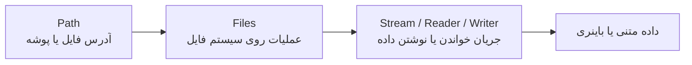
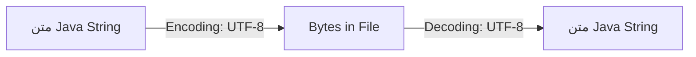
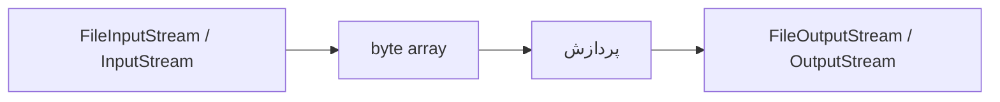

خپپخ
# جزوه جامع کار با فایل‌ها و I/O در جاوا

> [!summary] تعریف
> **File I/O** یا ورودی/خروجی فایل، مجموعه‌ای از ابزارها برای ایجاد، خواندن، نوشتن، کپی، جابه‌جایی، حذف و پیمایش فایل‌ها و پوشه‌ها در جاوا است.
>
> در جاوای مدرن، API پیشنهادی برای بیشتر سناریوها **`java.nio.file`** است؛ یعنی استفاده از `Path` و `Files`.  
> API قدیمی‌تر `java.io.File` و Streamهای کلاسیک همچنان کاربرد دارند، اما معمولاً انتخاب اول برای مدیریت مسیرها و فایل‌ها نیستند.

---

## فهرست مطالب

- [[#مدل ذهنی: فایل، مسیر و Stream]]
- [[#APIهای File I/O در جاوا]]
- [[#کلاس File در برابر Path]]
- [[#ایجاد و بررسی فایل و پوشه]]
- [[#خواندن و نوشتن فایل‌های متنی]]
- [[#Charset و مسئله Encoding]]
- [[#Try-with-resources و مدیریت منابع]]
- [[#Append کردن به فایل]]
- [[#کار با داده‌های باینری]]
- [[#DataInputStream و DataOutputStream]]
- [[#کپی، انتقال و حذف فایل]]
- [[#پیمایش پوشه‌ها]]
- [[#Attributeها و Permissionها]]
- [[#Exceptionهای رایج در File I/O]]
- [[#امنیت مسیرها و Path Traversal]]
- [[#بهترین شیوه‌ها]]
- [[#جمع‌بندی]]

---

# مدل ذهنی: فایل، مسیر و Stream

برای درک File I/O، باید این سه مفهوم را از هم جدا کنیم:



| مفهوم | توضیح |
|---|---|
| **Path** | مسیر یک فایل یا پوشه؛ مانند `logs/application.log` |
| **File** | API قدیمی جاوا برای نمایش مسیر فایل یا پوشه |
| **Files** | کلاس Utility برای اجرای عملیات فایل روی `Path` |
| **Stream** | جریان داده‌های باینری، مانند `InputStream` و `OutputStream` |
| **Reader / Writer** | جریان کاراکتری برای متن، مانند `BufferedReader` و `BufferedWriter` |
| **Charset** | قرارداد تبدیل بایت‌ها به کاراکترها؛ مانند UTF-8 |

> [!important]
> یک `Path` به معنای وجود داشتن فایل نیست؛ فقط یک مسیر را نمایش می‌دهد.  
> برای بررسی وجود فایل باید از `Files.exists(path)` استفاده کنید.

---

# APIهای File I/O در جاوا

جاوا دو خانواده مهم برای کار با فایل ارائه می‌کند:

| API | پکیج | وضعیت و کاربرد |
|---|---|---|
| I/O کلاسیک | `java.io` | قدیمی‌تر، همچنان کاربردی برای Streamها و Reader/Writerها |
| NIO.2 | `java.nio.file` | API مدرن و پیشنهادی از Java 7 به بعد |

## کلاس‌های مهم `java.io`

```java
import java.io.File;
import java.io.FileInputStream;
import java.io.FileOutputStream;
import java.io.BufferedReader;
import java.io.BufferedWriter;
import java.io.DataInputStream;
import java.io.DataOutputStream;
```

## کلاس‌های مهم `java.nio.file`

```java
import java.nio.file.Path;
import java.nio.file.Paths;
import java.nio.file.Files;
import java.nio.file.StandardOpenOption;
import java.nio.file.StandardCopyOption;
```

> [!tip] انتخاب پیشنهادی
> - برای خواندن و نوشتن فایل متنی: `Files.readString()`، `Files.writeString()`، `Files.newBufferedReader()` و `Files.newBufferedWriter()`
> - برای مدیریت فایل و پوشه: `Path` و `Files`
> - برای پردازش داده‌های باینری خام: `InputStream` و `OutputStream`
> - برای داده‌های اولیه با قالب باینری: `DataInputStream` و `DataOutputStream`

---

# کلاس `File` در برابر `Path`

## استفاده از `File`

```java
import java.io.File;

File file = new File("example.txt");

System.out.println(file.exists());
System.out.println(file.getAbsolutePath());
System.out.println(file.getName());
```

کلاس `File` در واقع نمایندهٔ یک مسیر است، نه لزوماً یک فایل واقعی روی دیسک.

---

## استفاده از `Path`

```java
import java.nio.file.Path;

Path path = Path.of("example.txt");

System.out.println(path.toAbsolutePath());
System.out.println(path.getFileName());
```

ساخت مسیر چندبخشی:

```java
Path logFile = Path.of("logs", "archive", "application.log");
```

مزیت مهم `Path.of(...)` این است که separator مناسب سیستم‌عامل را مدیریت می‌کند؛ بنابراین از ساخت دستی مسیرها با `/` یا `\` پرهیز کنید.

```java
// نامناسب
String path = "logs/" + "application.log";

// مناسب
Path path = Path.of("logs", "application.log");
```

---

# ایجاد و بررسی فایل و پوشه

## بررسی وجود فایل

```java
import java.io.IOException;
import java.nio.file.Files;
import java.nio.file.Path;

Path file = Path.of("example.txt");

if (Files.exists(file)) {
    System.out.println("File exists.");
} else {
    System.out.println("File does not exist.");
}
```

بررسی نوع مسیر:

```java
if (Files.isRegularFile(file)) {
    System.out.println("This is a regular file.");
}

if (Files.isDirectory(file)) {
    System.out.println("This is a directory.");
}
```

---

## ایجاد فایل

```java
import java.io.IOException;
import java.nio.file.Files;
import java.nio.file.Path;

Path file = Path.of("example.txt");

try {
    Files.createFile(file);
    System.out.println("File created: " + file.toAbsolutePath());
} catch (IOException exception) {
    System.err.println("Could not create file: " + exception.getMessage());
}
```

اگر فایل قبلاً وجود داشته باشد، `Files.createFile(...)` معمولاً `FileAlreadyExistsException` پرتاب می‌کند.

---

## ایجاد پوشه

```java
Path directory = Path.of("logs");

Files.createDirectory(directory);
```

اگر لازم باشد پوشه‌های والد نیز ساخته شوند، از `createDirectories` استفاده کنید:

```java
Path directory = Path.of("logs", "archive", "2026");

Files.createDirectories(directory);
```

تفاوت:

```text
createDirectory()    → فقط یک پوشه می‌سازد؛ والد باید وجود داشته باشد.
createDirectories()  → پوشه و تمام والدهای لازم را می‌سازد.
```

---

# خواندن و نوشتن فایل‌های متنی

## نوشتن سریع با `Files.writeString`

برای فایل‌های متنی کوچک تا متوسط، ساده‌ترین روش:

```java
import java.io.IOException;
import java.nio.charset.StandardCharsets;
import java.nio.file.Files;
import java.nio.file.Path;

public class WriteTextFile {

    public static void main(String[] args) {
        Path file = Path.of("example.txt");

        String content = """
                Hello, World!
                This is a test file.
                نوشته فارسی با UTF-8.
                """;

        try {
            Files.writeString(file, content, StandardCharsets.UTF_8);
            System.out.println("File written successfully.");
        } catch (IOException exception) {
            System.err.println("Failed to write file.");
            exception.printStackTrace();
        }
    }
}
```

> [!warning] رفتار پیش‌فرض
> `Files.writeString(...)` در حالت پیش‌فرض اگر فایل وجود داشته باشد، محتوای قبلی آن را **بازنویسی** می‌کند.

---

## خواندن سریع با `Files.readString`

```java
import java.io.IOException;
import java.nio.charset.StandardCharsets;
import java.nio.file.Files;
import java.nio.file.Path;

public class ReadTextFile {

    public static void main(String[] args) {
        Path file = Path.of("example.txt");

        try {
            String content = Files.readString(file, StandardCharsets.UTF_8);
            System.out.println(content);
        } catch (IOException exception) {
            System.err.println("Failed to read file.");
            exception.printStackTrace();
        }
    }
}
```

> [!warning] محدودیت حافظه
> `readString()` کل فایل را یک‌جا وارد حافظه می‌کند. برای فایل‌های بزرگ از `BufferedReader` یا `Files.lines()` استفاده کنید.

---

## خواندن خط‌به‌خط با `BufferedReader`

```java
import java.io.BufferedReader;
import java.io.IOException;
import java.nio.charset.StandardCharsets;
import java.nio.file.Files;
import java.nio.file.Path;

public class ReadLargeFile {

    public static void main(String[] args) {
        Path file = Path.of("example.txt");

        try (BufferedReader reader =
                     Files.newBufferedReader(file, StandardCharsets.UTF_8)) {

            String line;

            while ((line = reader.readLine()) != null) {
                System.out.println(line);
            }

        } catch (IOException exception) {
            exception.printStackTrace();
        }
    }
}
```

---

## نوشتن با `BufferedWriter`

```java
import java.io.BufferedWriter;
import java.io.IOException;
import java.nio.charset.StandardCharsets;
import java.nio.file.Files;
import java.nio.file.Path;

public class WriteLargeTextFile {

    public static void main(String[] args) {
        Path file = Path.of("example.txt");

        try (BufferedWriter writer =
                     Files.newBufferedWriter(file, StandardCharsets.UTF_8)) {

            writer.write("Hello, World!");
            writer.newLine();
            writer.write("This file was written using BufferedWriter.");

        } catch (IOException exception) {
            exception.printStackTrace();
        }
    }
}
```

**Buffering** باعث می‌شود عملیات‌های متعدد نوشتن یا خواندن، با مراجعه‌های کمتر به سیستم‌عامل و دیسک انجام شوند.

---

# Charset و مسئله Encoding

فایل روی دیسک فقط مجموعه‌ای از **بایت‌ها** است. برای تبدیل این بایت‌ها به متن باید Charset مشخص شود.



مثال:

```java
Files.writeString(path, "سلام", StandardCharsets.UTF_8);

String text = Files.readString(path, StandardCharsets.UTF_8);
```

> [!danger] خطای رایج Encoding
> اگر فایل با UTF-8 نوشته شود اما با Charset دیگری خوانده شود، حروف فارسی یا سایر کاراکترهای غیرانگلیسی ممکن است به‌هم‌ریخته نمایش داده شوند.

همیشه در پروژه‌های واقعی Charset را به‌صراحت تعیین کنید:

```java
StandardCharsets.UTF_8
```

---

# Try-with-resources و مدیریت منابع

فایل‌ها و Streamها منابع سیستم‌عامل هستند. اگر به‌درستی بسته نشوند، ممکن است باعث موارد زیر شوند:

- نشت منابع (*Resource Leak*)
- باز ماندن File Handle
- ناتوانی در حذف یا تغییر نام فایل، مخصوصاً در ویندوز
- مصرف بیش‌ازحد منابع سیستم

روش قدیمی:

```java
BufferedReader reader = null;

try {
    reader = new BufferedReader(new FileReader("example.txt"));
    // خواندن فایل
} finally {
    if (reader != null) {
        reader.close();
    }
}
```

روش مدرن و پیشنهادی با `try-with-resources`:

```java
try (BufferedReader reader =
             Files.newBufferedReader(Path.of("example.txt"), StandardCharsets.UTF_8)) {

    System.out.println(reader.readLine());

} catch (IOException exception) {
    exception.printStackTrace();
}
```

هر منبعی که `AutoCloseable` یا `Closeable` را پیاده‌سازی کرده باشد، پس از خروج از بلوک `try` به‌طور خودکار بسته می‌شود.

---

# Append کردن به فایل

برای افزودن محتوا به انتهای فایل، باید از `StandardOpenOption.APPEND` استفاده شود.

```java
import java.io.IOException;
import java.nio.charset.StandardCharsets;
import java.nio.file.Files;
import java.nio.file.Path;
import java.nio.file.StandardOpenOption;

Path file = Path.of("application.log");

try {
    Files.writeString(
            file,
            "New log entry%n".formatted(),
            StandardCharsets.UTF_8,
            StandardOpenOption.CREATE,
            StandardOpenOption.APPEND
    );
} catch (IOException exception) {
    exception.printStackTrace();
}
```

گزینه‌های مهم:

| گزینه | کاربرد |
|---|---|
| `CREATE` | اگر فایل وجود نداشته باشد، آن را ایجاد می‌کند |
| `CREATE_NEW` | فقط در صورت نبود فایل ایجاد می‌کند؛ در غیر این صورت خطا می‌دهد |
| `TRUNCATE_EXISTING` | محتوای قبلی فایل را پاک می‌کند |
| `APPEND` | داده را به انتهای فایل اضافه می‌کند |
| `WRITE` | اجازه نوشتن می‌دهد |
| `READ` | اجازه خواندن می‌دهد |

---

# کار با داده‌های باینری

برای فایل‌های غیرمتنی مانند تصویر، صوت، PDF، داده رمزنگاری‌شده یا هر قالب باینری دیگر، از `InputStream` و `OutputStream` استفاده می‌شود.



## کپی فایل باینری با Stream

```java
import java.io.IOException;
import java.io.InputStream;
import java.io.OutputStream;
import java.nio.file.Files;
import java.nio.file.Path;

public class BinaryCopyExample {

    public static void main(String[] args) {
        Path source = Path.of("image.png");
        Path destination = Path.of("backup-image.png");

        try (
            InputStream input = Files.newInputStream(source);
            OutputStream output = Files.newOutputStream(destination)
        ) {
            input.transferTo(output);

            System.out.println("File copied successfully.");

        } catch (IOException exception) {
            exception.printStackTrace();
        }
    }
}
```

با این حال، برای کپی ساده فایل معمولاً این روش کوتاه‌تر و مناسب‌تر است:

```java
Files.copy(
        Path.of("image.png"),
        Path.of("backup-image.png")
);
```

---

# `DataInputStream` و `DataOutputStream`

این کلاس‌ها برای ذخیره و بازیابی **نوع‌های اولیه جاوا** به شکل باینری استفاده می‌شوند.

> [!important]
> این روش یک فرمت اختصاصی باینری ایجاد می‌کند، نه یک فایل متنیِ قابل خواندن برای انسان.  
> ترتیب و نوع داده‌ها در زمان خواندن باید دقیقاً با ترتیب و نوع داده‌ها در زمان نوشتن یکسان باشد.

## نوشتن داده‌های اولیه

```java
import java.io.DataOutputStream;
import java.io.IOException;
import java.nio.file.Files;
import java.nio.file.Path;

public class WriteBinaryData {

    public static void main(String[] args) {
        Path file = Path.of("data.dat");

        try (DataOutputStream output =
                     new DataOutputStream(Files.newOutputStream(file))) {

            output.writeInt(123);
            output.writeDouble(456.789);
            output.writeBoolean(true);
            output.writeUTF("Java File I/O");

            System.out.println("Binary data written successfully.");

        } catch (IOException exception) {
            exception.printStackTrace();
        }
    }
}
```

---

## خواندن داده‌های اولیه

```java
import java.io.DataInputStream;
import java.io.IOException;
import java.nio.file.Files;
import java.nio.file.Path;

public class ReadBinaryData {

    public static void main(String[] args) {
        Path file = Path.of("data.dat");

        try (DataInputStream input =
                     new DataInputStream(Files.newInputStream(file))) {

            int id = input.readInt();
            double price = input.readDouble();
            boolean active = input.readBoolean();
            String title = input.readUTF();

            System.out.printf(
                    "id=%d, price=%.3f, active=%s, title=%s%n",
                    id, price, active, title
            );

        } catch (IOException exception) {
            exception.printStackTrace();
        }
    }
}
```

ترتیب خواندن باید با ترتیب نوشتن مطابق باشد:

```java
output.writeInt(123);       // اول
output.writeDouble(456.789); // دوم

input.readInt();            // اول
input.readDouble();         // دوم
```

اگر ترتیب را عوض کنیم، داده‌ها نادرست خوانده می‌شوند یا خطا رخ می‌دهد.

---

# کپی، انتقال و حذف فایل

## کپی فایل

```java
import java.io.IOException;
import java.nio.file.Files;
import java.nio.file.Path;
import java.nio.file.StandardCopyOption;

Path source = Path.of("source.txt");
Path target = Path.of("backup", "source.txt");

Files.createDirectories(target.getParent());

Files.copy(
        source,
        target,
        StandardCopyOption.REPLACE_EXISTING,
        StandardCopyOption.COPY_ATTRIBUTES
);
```

`REPLACE_EXISTING` یعنی اگر فایل مقصد وجود داشته باشد، بازنویسی شود.

---

## انتقال یا تغییر نام فایل

```java
import java.io.IOException;
import java.nio.file.Files;
import java.nio.file.Path;
import java.nio.file.StandardCopyOption;

Path source = Path.of("draft.txt");
Path target = Path.of("archive", "final.txt");

Files.createDirectories(target.getParent());

Files.move(
        source,
        target,
        StandardCopyOption.REPLACE_EXISTING
);
```

در مواردی که سیستم فایل پشتیبانی کند، می‌توان انتقال اتمیک درخواست کرد:

```java
Files.move(
        source,
        target,
        StandardCopyOption.ATOMIC_MOVE
);
```

> [!note]
> `ATOMIC_MOVE` در همه سیستم‌فایل‌ها یا هنگام انتقال بین دو Disk/Filesystem تضمین‌شده نیست و ممکن است `AtomicMoveNotSupportedException` رخ دهد.

---

## حذف فایل

```java
Path file = Path.of("example.txt");

try {
    Files.delete(file);
    System.out.println("File deleted.");
} catch (IOException exception) {
    exception.printStackTrace();
}
```

اگر فایل وجود نداشته باشد، `NoSuchFileException` پرتاب می‌شود. اگر می‌خواهید نبود فایل خطا محسوب نشود:

```java
boolean deleted = Files.deleteIfExists(Path.of("example.txt"));

System.out.println(deleted ? "File deleted." : "File did not exist.");
```

> [!danger] حذف پوشه
> یک پوشه تنها زمانی با `Files.delete(...)` حذف می‌شود که خالی باشد. حذف بازگشتی پوشه باید با احتیاط بسیار انجام شود.

---

# پیمایش پوشه‌ها

## لیست‌کردن محتوای مستقیم یک پوشه

```java
import java.io.IOException;
import java.nio.file.Files;
import java.nio.file.Path;
import java.util.stream.Stream;

Path directory = Path.of("logs");

try (Stream<Path> paths = Files.list(directory)) {
    paths.forEach(System.out::println);
} catch (IOException exception) {
    exception.printStackTrace();
}
```

> [!important]
> خروجی `Files.list(...)` یک `Stream` است و باید با `try-with-resources` بسته شود.

---

## پیمایش بازگشتی

```java
import java.io.IOException;
import java.nio.file.Files;
import java.nio.file.Path;
import java.util.stream.Stream;

Path rootDirectory = Path.of("project");

try (Stream<Path> paths = Files.walk(rootDirectory)) {
    paths
        .filter(Files::isRegularFile)
        .forEach(System.out::println);
} catch (IOException exception) {
    exception.printStackTrace();
}
```

جست‌وجوی فایل‌های خاص:

```java
try (Stream<Path> paths = Files.find(
        Path.of("project"),
        5,
        (path, attributes) ->
                attributes.isRegularFile()
                && path.toString().endsWith(".java")
)) {
    paths.forEach(System.out::println);
}
```

---

# Attributeها و Permissionها

## اطلاعات پایه فایل

```java
import java.io.IOException;
import java.nio.file.Files;
import java.nio.file.Path;

Path file = Path.of("example.txt");

System.out.println("Size: " + Files.size(file) + " bytes");
System.out.println("Last modified: " + Files.getLastModifiedTime(file));
System.out.println("Readable: " + Files.isReadable(file));
System.out.println("Writable: " + Files.isWritable(file));
System.out.println("Executable: " + Files.isExecutable(file));
```

---

## خواندن Attributeهای کامل‌تر

```java
import java.nio.file.attribute.BasicFileAttributes;

BasicFileAttributes attributes =
        Files.readAttributes(file, BasicFileAttributes.class);

System.out.println("Is directory: " + attributes.isDirectory());
System.out.println("Is regular file: " + attributes.isRegularFile());
System.out.println("Created at: " + attributes.creationTime());
System.out.println("Last modified: " + attributes.lastModifiedTime());
System.out.println("Size: " + attributes.size());
```

> [!note]
> قابلیت‌هایی مانند Permissionهای POSIX در تمام سیستم‌عامل‌ها پشتیبانی نمی‌شوند. پیش از اتکا به آن‌ها باید نوع File System محیط اجرا را در نظر بگیرید.

---

# Exceptionهای رایج در File I/O

| Exception | علت متداول |
|---|---|
| `IOException` | خطای عمومی ورودی/خروجی |
| `NoSuchFileException` | فایل یا مسیر وجود ندارد |
| `FileAlreadyExistsException` | فایل یا پوشه از قبل وجود دارد |
| `AccessDeniedException` | مجوز خواندن، نوشتن یا حذف ندارید |
| `DirectoryNotEmptyException` | تلاش برای حذف پوشه غیرخالی |
| `NotDirectoryException` | عملیات پوشه روی یک فایل عادی |
| `AtomicMoveNotSupportedException` | انتقال اتمیک در محیط فعلی پشتیبانی نمی‌شود |
| `MalformedInputException` | Charset اشتباه یا محتوای متنی نامعتبر |

نمونه مدیریت دقیق:

```java
try {
    Files.delete(Path.of("important-file.txt"));

} catch (NoSuchFileException exception) {
    System.err.println("File does not exist.");

} catch (AccessDeniedException exception) {
    System.err.println("Permission denied.");

} catch (IOException exception) {
    System.err.println("Unexpected I/O error.");
    exception.printStackTrace();
}
```

---

# امنیت مسیرها و Path Traversal

اگر بخشی از مسیر فایل از ورودی کاربر دریافت شود، خطر **Path Traversal** وجود دارد:

```text
../../sensitive-file.txt
```

نمونه ناامن:

```java
Path file = Path.of("uploads", userInput);
```

اگر `userInput` شامل `../` باشد، ممکن است کاربر بتواند از پوشه مجاز خارج شود.

روش امن‌تر:

```java
import java.nio.file.Path;

Path uploadRoot = Path.of("uploads").toAbsolutePath().normalize();

Path requestedFile = uploadRoot
        .resolve(userInput)
        .normalize();

if (!requestedFile.startsWith(uploadRoot)) {
    throw new SecurityException("Invalid file path.");
}
```

اکنون فقط مسیرهایی قابل قبول‌اند که پس از `normalize()` همچنان زیر پوشه `uploads` باقی بمانند.

> [!danger] هرگز به ورودی مسیر اعتماد نکنید
> در برنامه‌های وب، نام فایل آپلودشده، شناسه فایل و مسیر دانلود باید اعتبارسنجی شوند. همچنین بهتر است فایل‌ها با نام تولیدشده توسط سرور ذخیره شوند، نه نام اصلی ارسالی کاربر.

---

# بهترین شیوه‌ها

## ۱. `Path` و `Files` را بر `File` ترجیح دهید

```java
// قدیمی‌تر
File file = new File("logs/app.log");

// مدرن و پیشنهادی
Path file = Path.of("logs", "app.log");
```

---

## ۲. همیشه `Charset` را مشخص کنید

```java
Files.writeString(path, content, StandardCharsets.UTF_8);
```

این کار مشکلات مربوط به Encoding و تفاوت تنظیمات سیستم‌عامل را کاهش می‌دهد.

---

## ۳. از `try-with-resources` استفاده کنید

```java
try (BufferedWriter writer =
             Files.newBufferedWriter(path, StandardCharsets.UTF_8)) {
    writer.write("Safe resource management");
}
```

---

## ۴. فایل‌های بزرگ را کامل وارد حافظه نکنید

```java
// فقط برای فایل‌های کوچک مناسب است
String text = Files.readString(path);

// برای فایل‌های بزرگ بهتر است
try (BufferedReader reader =
             Files.newBufferedReader(path, StandardCharsets.UTF_8)) {
    // line-by-line processing
}
```

---

## ۵. قبل از نوشتن، پوشه والد را بسازید

```java
Path output = Path.of("reports", "daily", "report.txt");

Files.createDirectories(output.getParent());
Files.writeString(output, "Report content", StandardCharsets.UTF_8);
```

---

## ۶. برای داده‌های ساخت‌یافته از فرمت مناسب استفاده کنید

برای ذخیره اطلاعات تجاری یا داده‌های قابل تبادل، `DataOutputStream` همیشه بهترین انتخاب نیست. بسته به نیاز از فرمت‌های زیر استفاده کنید:

| نیاز | انتخاب مناسب |
|---|---|
| داده قابل‌خواندن برای انسان | Text / CSV |
| تبادل با APIها | JSON |
| حجم کمتر و سرعت بالاتر | Protocol Buffers / Avro |
| داده رابطه‌ای و پایدار | Database |
| ذخیره ساده نوع‌های اولیه | `DataOutputStream` |

---

## ۷. عملیات حساس را تا حد امکان اتمیک طراحی کنید

برای جلوگیری از باقی‌ماندن فایل نیمه‌نوشته، ابتدا در یک فایل موقت بنویسید و سپس آن را منتقل کنید:

```java
Path target = Path.of("config.json");
Path temporary = Path.of("config.json.tmp");

Files.writeString(temporary, jsonContent, StandardCharsets.UTF_8);

Files.move(
        temporary,
        target,
        StandardCopyOption.REPLACE_EXISTING,
        StandardCopyOption.ATOMIC_MOVE
);
```

این الگو برای فایل‌های تنظیمات، گزارش‌ها و خروجی‌های مهم مفید است.

---

# جدول انتخاب ابزار

| سناریو | ابزار پیشنهادی |
|---|---|
| خواندن یک فایل متنی کوچک | `Files.readString()` |
| نوشتن فایل متنی کوچک | `Files.writeString()` |
| خواندن فایل بسیار بزرگ | `BufferedReader` |
| نوشتن تدریجی حجم زیادی از متن | `BufferedWriter` |
| خواندن یا نوشتن عکس و PDF | `InputStream` / `OutputStream` یا `Files.copy()` |
| ذخیره `int`، `double` و `boolean` به صورت باینری | `DataInputStream` / `DataOutputStream` |
| ایجاد، حذف، کپی و انتقال فایل | `Files` و `Path` |
| پیمایش بازگشتی پوشه‌ها | `Files.walk()` |
| اعتبارسنجی مسیر ورودی کاربر | `resolve()` + `normalize()` + `startsWith()` |

---

# جمع‌بندی

1. برای توسعه مدرن جاوا، `Path` و `Files` از پکیج `java.nio.file` انتخاب پیش‌فرض و پیشنهادی هستند.
2. برای متن، از `Reader/Writer` و با Charset صریح، معمولاً `UTF-8`، استفاده کنید.
3. برای داده‌های باینری از `InputStream/OutputStream` استفاده می‌شود.
4. `DataInputStream` و `DataOutputStream` برای ذخیره نوع‌های اولیه جاوا به قالب باینری مناسب‌اند؛ ترتیب خواندن و نوشتن باید یکسان باشد.
5. همیشه منابع باز را با `try-with-resources` ببندید.
6. هنگام کار با فایل‌های بزرگ، داده را جریان‌وار (*Streaming*) پردازش کنید، نه یک‌جا در حافظه.
7. مسیرهای ساخته‌شده از ورودی کاربر را در برابر **Path Traversal** اعتبارسنجی کنید.
8. برای فایل‌های مهم، نوشتن در فایل موقت و سپس انتقال اتمیک را در نظر بگیرید.

> [!quote]
> کار با فایل فقط خواندن و نوشتن چند بایت نیست؛ مدیریت درست مسیر، Charset، منابع، خطاها و امنیت است که File I/O را قابل اعتماد می‌کند.