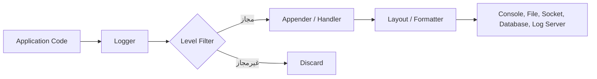
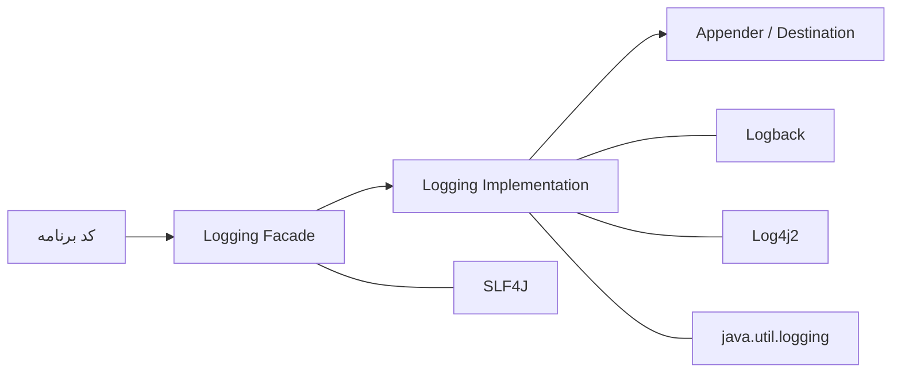

# جزوه جامع Logging در جاوا

> [!summary] تعریف
> **Logging** یا لاگ‌گیری، فرایند ثبت ساخت‌یافته و خودکار رویدادهای مهم برنامه در زمان اجرا است.  
> لاگ‌ها به توسعه‌دهنده و تیم عملیات کمک می‌کنند رفتار سیستم، خطاها، وضعیت درخواست‌ها، رخدادهای امنیتی و مسائل عملکردی را تحلیل کنند.

برخلاف `System.out.println()`، یک سیستم لاگ‌گیری استاندارد امکاناتی مانند موارد زیر دارد:

- سطح‌بندی پیام‌ها (`DEBUG`, `INFO`, `WARN`, `ERROR`)
- فعال یا غیرفعال‌کردن لاگ در محیط‌های مختلف
- ذخیره‌سازی در کنسول، فایل، دیتابیس یا سامانه‌های مرکزی
- چرخش فایل‌های لاگ (*Log Rotation*)
- قالب‌بندی استاندارد و افزودن زمان، نام نخ، کلاس و شناسه درخواست
- ثبت Exception همراه با Stack Trace
- ثبت ناهمگام برای کاهش اثر لاگ‌نویسی بر عملکرد برنامه

---

## فهرست مطالب

- [[#چرا به Logging نیاز داریم؟]]
- [[#اجزای اصلی یک سیستم Logging]]
- [[#سطوح لاگ (Log Levels)]]
- [[#معماری Logging در جاوا]]
- [[#SLF4J؛ لایه انتزاعی Logging]]
- [[#Logback]]
  - [[#راه‌اندازی Logback]]
  - [[#پیکربندی logback.xml]]
  - [[#Appenderها و Log Rotation]]
- [[#Log4j2]]
  - [[#راه‌اندازی Log4j2]]
  - [[#پیکربندی log4j2.xml]]
- [[#ثبت صحیح Exception]]
- [[#Parameterized Logging و Performance]]
- [[#MDC و Correlation ID]]
- [[#بهترین شیوه‌ها و خطاهای رایج]]
- [[#مقایسه Logback و Log4j2]]
- [[#جمع‌بندی]]

---

# چرا به Logging نیاز داریم؟

در برنامه‌های واقعی، مخصوصاً برنامه‌های سمت سرور، معمولاً امکان اتصال مستقیم Debugger به محیط Production وجود ندارد. بنابراین لاگ‌ها مهم‌ترین منبع برای فهمیدن اتفاقات رخ‌داده در برنامه هستند.


کاربردهای مهم:

| کاربرد | نمونه |
|---|---|
| **اشکال‌زدایی** | بررسی مقدار متغیرها یا مسیر اجرای یک درخواست |
| **ثبت خطا** | ذخیره `Exception` و Stack Trace برای تحلیل بعدی |
| **مانیتورینگ** | ثبت زمان پاسخ API یا وضعیت سرویس‌ها |
| **امنیت و Audit** | ثبت ورود کاربر، تغییر رمز، تغییر نقش یا عملیات حساس |
| **تحلیل کسب‌وکار** | ثبت رخدادهایی مانند ایجاد سفارش یا پرداخت موفق |
| **ردیابی توزیع‌شده** | دنبال‌کردن یک درخواست میان چند سرویس |

> [!warning] لاگ جایگزین Monitoring نیست
> لاگ‌ها برای رخدادها و جزئیات تشخیصی مفیدند؛ اما معیارهایی مانند مصرف CPU، تعداد درخواست، نرخ خطا و زمان پاسخ معمولاً با **Metrics** و ابزارهای Monitoring مانند Prometheus و Grafana بهتر بررسی می‌شوند.

---

# اجزای اصلی یک سیستم Logging

اگرچه نام و معماری اجزا در فریم‌ورک‌ها کمی تفاوت دارد، مفاهیم اصلی یکسان هستند:



## ۱. Logger

**Logger** نقطه‌ای است که کد برنامه از طریق آن پیام لاگ ثبت می‌کند.

```java
private static final Logger logger =
        LoggerFactory.getLogger(MyService.class);

logger.info("Service started");
```

معمولاً برای هر کلاس یک Logger ایجاد می‌شود. نام Logger غالباً نام کامل کلاس است:

```text
com.example.service.OrderService
```

این ساختار نام‌گذاری سلسله‌مراتبی اجازه می‌دهد سطح لاگ یک پکیج خاص را جداگانه تنظیم کنیم.

---

## ۲. Appender یا Handler

این جزء تعیین می‌کند پیام لاگ **به کجا** ارسال شود.

نام آن در ابزارهای مختلف متفاوت است:

| ابزار | نام مفهوم |
|---|---|
| `java.util.logging` | `Handler` |
| Logback | `Appender` |
| Log4j2 | `Appender` |

مقصدهای رایج:

- کنسول (`ConsoleAppender`)
- فایل (`FileAppender`)
- فایل چرخشی (`RollingFileAppender`)
- سرویس لاگ مرکزی
- Socket یا پیام‌رسان
- خروجی JSON برای سیستم‌هایی مانند ELK / OpenSearch

---

## ۳. Layout یا Formatter

این بخش مشخص می‌کند یک پیام لاگ **با چه قالبی** نمایش یا ذخیره شود.

نمونه خروجی:

```text
2026-08-25 14:30:10.842 [http-nio-8080-exec-2] INFO  c.e.service.OrderService - Order created: 1254
```

اجزای متداول این خروجی:

- زمان ثبت پیام
- نام Thread
- سطح لاگ
- نام Logger یا کلاس
- متن پیام
- Stack Trace خطا در صورت وجود

---

# سطوح لاگ (Log Levels)

بیشتر فریم‌ورک‌های رایج از سطح‌های زیر استفاده می‌کنند:

| سطح | کاربرد | مثال |
|---|---|---|
| `TRACE` | جزئی‌ترین اطلاعات برای ردیابی دقیق | ورود و خروج از هر متد |
| `DEBUG` | جزئیات مورد نیاز توسعه‌دهنده | مقدار متغیرها، پارامترها |
| `INFO` | رویدادهای عادی و مهم برنامه | سرویس شروع شد، سفارش ثبت شد |
| `WARN` | وضعیت غیرعادی اما قابل ادامه | استفاده از مقدار پیش‌فرض |
| `ERROR` | خطا یا شکست یک عملیات | اتصال دیتابیس ناموفق بود |
| `FATAL` | خطای بحرانی و غیرقابل ادامه | عمدتاً در Log4j2 وجود دارد |

ترتیب شدت معمولاً به شکل زیر است:

```text
TRACE < DEBUG < INFO < WARN < ERROR < FATAL
```

اگر سطح Logger روی `INFO` تنظیم شده باشد، فقط پیام‌های `INFO`، `WARN` و `ERROR` ثبت می‌شوند:

```xml
<root level="INFO">
    ...
</root>
```

در این حالت، پیام‌های `TRACE` و `DEBUG` نادیده گرفته می‌شوند.

> [!tip] پیشنهاد محیطی
> - **Development:** معمولاً `DEBUG`
> - **Test/Staging:** معمولاً `INFO` یا `DEBUG` محدود
> - **Production:** معمولاً `INFO`؛ و برای پکیج خاص هنگام عیب‌یابی موقتاً `DEBUG`

---

# معماری Logging در جاوا

در اکوسیستم جاوا معمولاً سه لایه وجود دارد:



## Logging Facade چیست؟

یک **Facade** رابطی استاندارد و مستقل است که کد برنامه با آن کار می‌کند، بدون اینکه مستقیماً به پیاده‌سازی نهایی وابسته باشد.

معروف‌ترین Facade در جاوا:

- **SLF4J**: مخفف *Simple Logging Facade for Java*

بهترین رویکرد این است که کد برنامه به `SLF4J` وابسته باشد و انتخاب Logback یا Log4j2 در پیکربندی و وابستگی‌های پروژه انجام شود.

---

# SLF4J؛ لایه انتزاعی Logging

در SLF4J از این importها استفاده می‌شود:

```java
import org.slf4j.Logger;
import org.slf4j.LoggerFactory;
```

ساخت Logger:

```java
public class PaymentService {

    private static final Logger logger =
            LoggerFactory.getLogger(PaymentService.class);

    public void process() {
        logger.info("Payment processing started");
    }
}
```

مزیت اصلی:

```java
// کد برنامه به SLF4J متکی است:
logger.info("User created: {}", userId);
```

اما در زمان اجرا می‌توان تعیین کرد که لاگ‌ها توسط Logback یا Log4j2 پردازش شوند.

> [!important]
> در یک برنامه، معمولاً باید فقط **یک Logging Backend** فعال باشد.  
> داشتن چند Binding ناسازگار SLF4J می‌تواند باعث هشدار، خروجی تکراری یا رفتار نامشخص شود.

---

# Logback

**Logback** یک پیاده‌سازی محبوب Logging است که توسط سازنده اصلی Log4j توسعه داده شد و معمولاً همراه با SLF4J استفاده می‌شود.

ویژگی‌های مهم:

- سازگاری طبیعی با SLF4J
- پیکربندی XML، Groovy یا برنامه‌نویسی
- پشتیبانی از چرخش فایل‌ها
- مناسب برای اغلب پروژه‌های Spring Boot
- پشتیبانی از MDC
- قابلیت فیلترکردن لاگ‌ها

---

## راه‌اندازی Logback

برای Maven:

```xml
<dependencies>
    <dependency>
        <groupId>org.slf4j</groupId>
        <artifactId>slf4j-api</artifactId>
        <version>2.0.16</version>
    </dependency>

    <dependency>
        <groupId>ch.qos.logback</groupId>
        <artifactId>logback-classic</artifactId>
        <version>1.5.16</version>
    </dependency>
</dependencies>
```

> [!note]
> در بسیاری از پروژه‌های Spring Boot، وابستگی `spring-boot-starter-logging` به‌صورت پیش‌فرض Logback را فراهم می‌کند و معمولاً نیاز نیست وابستگی‌ها را دستی اضافه کنید.

---

## پیکربندی `logback.xml`

فایل زیر باید معمولاً در مسیر `src/main/resources/logback.xml` قرار گیرد:

```xml
<?xml version="1.0" encoding="UTF-8"?>
<configuration>

    <appender name="STDOUT"
              class="ch.qos.logback.core.ConsoleAppender">

        <encoder>
            <pattern>
                %d{yyyy-MM-dd HH:mm:ss.SSS} [%thread] %-5level %logger{36} - %msg%n
            </pattern>
        </encoder>
    </appender>

    <root level="INFO">
        <appender-ref ref="STDOUT"/>
    </root>

</configuration>
```

### توضیح Pattern

| الگو | معنا |
|---|---|
| `%d{...}` | تاریخ و زمان |
| `%thread` | نام Thread جاری |
| `%-5level` | سطح لاگ با عرض حداقل ۵ کاراکتر |
| `%logger{36}` | نام Logger با حداکثر طول ۳۶ |
| `%msg` | متن پیام |
| `%n` | رفتن به خط بعدی |
| `%ex` | نمایش Exception و Stack Trace |

---

## نمونه استفاده از Logback از طریق SLF4J

```java
import org.slf4j.Logger;
import org.slf4j.LoggerFactory;

public class MyApp {

    private static final Logger logger =
            LoggerFactory.getLogger(MyApp.class);

    public static void main(String[] args) {
        logger.info("Application started");
        logger.debug("Debug mode is active");
        logger.warn("Cache response time is higher than expected");

        try {
            int result = 10 / 0;
            logger.info("Result: {}", result);
        } catch (ArithmeticException exception) {
            logger.error("Could not calculate the result", exception);
        }

        logger.info("Application finished");
    }
}
```

خروجی احتمالی:

```text
2026-08-25 14:30:10.842 [main] INFO  MyApp - Application started
2026-08-25 14:30:10.844 [main] WARN  MyApp - Cache response time is higher than expected
2026-08-25 14:30:10.845 [main] ERROR MyApp - Could not calculate the result
java.lang.ArithmeticException: / by zero
    at MyApp.main(MyApp.java:14)
```

---

## Appender فایل و Log Rotation در Logback

ثبت لاگ در یک فایل بدون محدودیت اندازه، در بلندمدت فضای دیسک را پر می‌کند. بنابراین از **RollingFileAppender** استفاده می‌کنیم.

```xml
<configuration>

    <appender name="FILE"
              class="ch.qos.logback.core.rolling.RollingFileAppender">

        <file>logs/application.log</file>

        <rollingPolicy
            class="ch.qos.logback.core.rolling.TimeBasedRollingPolicy">

            <fileNamePattern>
                logs/archive/application.%d{yyyy-MM-dd}.%i.log.gz
            </fileNamePattern>

            <timeBasedFileNamingAndTriggeringPolicy
                class="ch.qos.logback.core.rolling.SizeAndTimeBasedFNATP">

                <maxFileSize>10MB</maxFileSize>
            </timeBasedFileNamingAndTriggeringPolicy>

            <maxHistory>30</maxHistory>
            <totalSizeCap>2GB</totalSizeCap>
        </rollingPolicy>

        <encoder>
            <pattern>%d{yyyy-MM-dd HH:mm:ss.SSS} %-5level %logger{36} - %msg%n</pattern>
        </encoder>
    </appender>

    <root level="INFO">
        <appender-ref ref="FILE"/>
    </root>

</configuration>
```

این تنظیمات:

- لاگ فعال را در `logs/application.log` ذخیره می‌کند.
- فایل‌ها را بر اساس تاریخ و حجم، چرخش می‌دهد.
- هر فایل را در ۱۰ مگابایت محدود می‌کند.
- لاگ‌های آرشیوی را تا ۳۰ روز نگه می‌دارد.
- سقف کل فضای آرشیو را ۲ گیگابایت تعیین می‌کند.

---

# Log4j2

**Log4j2** نسل جدید Log4j از بنیاد Apache است. این ابزار امکانات قدرتمندی برای پیکربندی، عملکرد بالا و Logging ناهمگام ارائه می‌دهد.

ویژگی‌های برجسته:

- پشتیبانی مناسب از **Asynchronous Logging**
- تنظیمات XML، JSON، YAML و Properties
- فیلترهای متنوع
- Appenderهای متعدد
- پشتیبانی از `ThreadContext` برای داده‌های زمینه‌ای
- پشتیبانی از API اختصاصی Log4j2 و همچنین SLF4J

> [!warning] نکته امنیتی
> در گذشته آسیب‌پذیری بسیار مهمی با نام **Log4Shell** در نسخه‌های مشخصی از Log4j2 گزارش شد.  
> در پروژه‌های واقعی، همواره نسخه‌های وابستگی را به‌روز نگه دارید، منابع ورودی غیرقابل اعتماد را با احتیاط ثبت کنید و از نسخه‌های آسیب‌پذیر استفاده نکنید.

---

## راه‌اندازی Log4j2 با API اختصاصی

برای Maven:

```xml
<dependencies>
    <dependency>
        <groupId>org.apache.logging.log4j</groupId>
        <artifactId>log4j-api</artifactId>
        <version>2.24.3</version>
    </dependency>

    <dependency>
        <groupId>org.apache.logging.log4j</groupId>
        <artifactId>log4j-core</artifactId>
        <version>2.24.3</version>
    </dependency>
</dependencies>
```

> [!tip]
> اگر پروژه بر پایه SLF4J است، بهتر است API برنامه را با `org.slf4j.Logger` نگه دارید و اتصال مناسب SLF4J به Log4j2 را پیکربندی کنید؛ از مخلوط‌کردن APIهای متفاوت بدون شناخت وابستگی‌ها پرهیز کنید.

---

## پیکربندی `log4j2.xml`

این فایل را در `src/main/resources/log4j2.xml` قرار دهید:

```xml
<?xml version="1.0" encoding="UTF-8"?>
<Configuration status="WARN">

    <Appenders>
        <Console name="Console" target="SYSTEM_OUT">
            <PatternLayout
                pattern="%d{yyyy-MM-dd HH:mm:ss.SSS} [%t] %-5level %logger{36} - %msg%n"/>
        </Console>
    </Appenders>

    <Loggers>
        <Root level="info">
            <AppenderRef ref="Console"/>
        </Root>
    </Loggers>

</Configuration>
```

---

## نمونه استفاده از API Log4j2

```java
import org.apache.logging.log4j.LogManager;
import org.apache.logging.log4j.Logger;

public class MyApp {

    private static final Logger logger =
            LogManager.getLogger(MyApp.class);

    public static void main(String[] args) {
        logger.info("Application started");
        logger.warn("The external service is responding slowly");

        try {
            int result = 10 / 0;
            logger.debug("Result: {}", result);
        } catch (ArithmeticException exception) {
            logger.error("Calculation failed", exception);
        }

        logger.info("Application finished");
    }
}
```

---

# ثبت صحیح Exception

یکی از رایج‌ترین اشتباهات این است که فقط متن Exception ثبت شود:

```java
// نامناسب: Stack Trace از دست می‌رود
logger.error("Error: {}", exception.getMessage());
```

این روش اطلاعات مهمی مانند محل خطا، زنجیره علت‌ها (*Cause Chain*) و نام متدها را حذف می‌کند.

روش صحیح:

```java
logger.error("Failed to save order with id={}", orderId, exception);
```

در این حالت:

- پیام دارای اطلاعات زمینه‌ای است.
- Stack Trace کامل ذخیره می‌شود.
- تحلیل علت خطا بسیار آسان‌تر خواهد بود.

نمونه بهتر:

```java
try {
    orderRepository.save(order);
} catch (DatabaseException exception) {
    logger.error(
        "Order persistence failed. orderId={}, userId={}",
        order.getId(),
        order.getUserId(),
        exception
    );

    throw exception;
}
```

> [!important]
> اگر قرار است Exception دوباره به لایه بالاتر پرتاب شود، در هر لایه آن را بی‌دلیل با سطح `ERROR` لاگ نکنید؛ زیرا ممکن است یک خطا چند بار در لاگ ثبت شود. معمولاً خطا را در نقطه‌ای لاگ کنید که تصمیم نهایی برای پاسخ‌گویی یا مدیریت آن گرفته می‌شود.

---

# Parameterized Logging و Performance

از چسباندن رشته‌ها برای پیام‌هایی که ممکن است ثبت نشوند پرهیز کنید:

```java
// نامناسب: حتی اگر DEBUG غیرفعال باشد، رشته ساخته می‌شود.
logger.debug("User data: " + user.getId() + ", " + user.getEmail());
```

روش بهتر با Placeholder:

```java
// مناسب: ساخت پیام معمولاً فقط در صورت نیاز انجام می‌شود.
logger.debug(
    "User data: id={}, email={}",
    user.getId(),
    user.getEmail()
);
```

در SLF4J و Log4j2 از `{}` برای جای‌گذاری مقادیر استفاده می‌شود.

برای محاسبات واقعاً سنگین، ابتدا سطح لاگ را بررسی کنید:

```java
if (logger.isDebugEnabled()) {
    String diagnosticData = createExpensiveDiagnosticReport();
    logger.debug("Diagnostic report: {}", diagnosticData);
}
```

---

# MDC و Correlation ID

در یک برنامه وب، درخواست‌های کاربران به‌طور همزمان توسط Threadهای مختلف پردازش می‌شوند. بدون شناسهٔ درخواست، تشخیص اینکه هر خط لاگ متعلق به کدام درخواست است دشوار خواهد بود.

**MDC** یا *Mapped Diagnostic Context* مجموعه‌ای از اطلاعات زمینه‌ای برای Thread جاری است.

نمونه با SLF4J:

```java
import org.slf4j.MDC;

public void handleRequest(String requestId, String userId) {
    try {
        MDC.put("requestId", requestId);
        MDC.put("userId", userId);

        logger.info("Request processing started");
        // پردازش درخواست
        logger.info("Request processing finished");

    } finally {
        MDC.clear();
    }
}
```

در `logback.xml`:

```xml
<pattern>
    %d{HH:mm:ss.SSS} [%thread] %-5level
    [requestId=%X{requestId}] [userId=%X{userId}]
    %logger{36} - %msg%n
</pattern>
```

خروجی:

```text
14:42:11.903 [http-nio-8080-exec-4] INFO [requestId=a8f2c1] [userId=42] OrderService - Order created
```

> [!warning] نکته در Executor و Thread Pool
> MDC معمولاً به Thread وابسته است. زمانی که کاری به یک Thread Pool فرستاده می‌شود، ممکن است اطلاعات MDC خودکار منتقل نشود. در برنامه‌های Async باید Context را آگاهانه منتقل و پس از پایان کار پاک‌سازی کنید.

---

# پیکربندی سطح لاگ برای پکیج‌ها

می‌توان سطح لاگ کل برنامه را `INFO` نگه داشت، اما برای یک پکیج خاص در زمان عیب‌یابی `DEBUG` را فعال کرد:

```xml
<configuration>

    <logger name="com.example.payment" level="DEBUG"/>

    <root level="INFO">
        <appender-ref ref="STDOUT"/>
    </root>

</configuration>
```

در نتیجه، فقط لاگ‌های کلاس‌های پکیج `com.example.payment` با سطح `DEBUG` ثبت می‌شوند و سایر بخش‌ها همچنان `INFO` هستند.

---

# بهترین شیوه‌ها و خطاهای رایج

## ۱. از `System.out.println()` برای Production استفاده نکنید

```java
// نامناسب
System.out.println("User logged in");
```

مشکلات:

- سطح‌بندی ندارد.
- قالب استاندارد ندارد.
- مدیریت فایل و چرخش ندارد.
- کنترل آن در محیط‌های مختلف دشوار است.
- ممکن است خروجی نامناسب یا بیش‌ازحد تولید کند.

---

## ۲. داده‌های حساس را لاگ نکنید

هرگز موارد زیر را در لاگ ثبت نکنید:

- رمز عبور
- Token احراز هویت
- کلید API
- شماره کامل کارت بانکی
- اطلاعات شخصی حساس
- محتوای کامل Header `Authorization`

```java
// بسیار خطرناک
logger.info("Login request: username={}, password={}", username, password);
```

روش بهتر:

```java
logger.info("Login attempt for username={}", username);
```

در صورت نیاز، داده‌های حساس را Mask کنید:

```java
String maskedCard = "**** **** **** " + cardNumber.substring(cardNumber.length() - 4);
logger.info("Payment initiated with card={}", maskedCard);
```

---

## ۳. سطح لاگ مناسب انتخاب کنید

```java
logger.debug("Loaded {} products from cache", products.size());
logger.info("Application started on port {}", port);
logger.warn("Retrying request after timeout. attempt={}", attempt);
logger.error("Payment gateway request failed", exception);
```

استفاده بیش‌ازحد از `ERROR` موجب می‌شود خطاهای واقعی در میان پیام‌های غیرضروری گم شوند.

---

## ۴. پیام لاگ باید دارای Context باشد

```java
// ضعیف
logger.error("Failed");

// بهتر
logger.error(
    "Failed to process payment. orderId={}, userId={}",
    orderId,
    userId,
    exception
);
```

پیام خوب معمولاً پاسخ این پرسش‌ها را دارد:

- چه عملیاتی ناموفق شد؟
- مربوط به کدام موجودیت یا شناسه بود؟
- چه خطایی رخ داد؟
- در چه زمینه‌ای رخ داد؟

---

## ۵. Log Rotation و سیاست نگهداری را فراموش نکنید

بدون محدودیت حجم یا دوره نگهداری، فایل‌های لاگ ممکن است تمام فضای دیسک را مصرف کنند. در محیط عملیاتی باید موارد زیر مشخص باشند:

- اندازه حداکثر هر فایل
- تعداد روزهای نگهداری
- سقف کل فضای لاگ
- محل ارسال یا آرشیو لاگ‌ها

---

## ۶. لاگ‌های ساخت‌یافته (Structured Logging)

در معماری‌های مدرن، به‌ویژه Microserviceها، لاگ JSON باعث جست‌وجو و تحلیل ساده‌تر می‌شود:

```json
{
  "timestamp": "2026-08-25T14:45:12.102Z",
  "level": "INFO",
  "service": "order-service",
  "requestId": "a8f2c1",
  "orderId": 1254,
  "message": "Order created successfully"
}
```

این ساختار برای ابزارهایی مانند Elasticsearch، Kibana، OpenSearch و Grafana Loki مناسب‌تر از متن آزاد است.

---

# مقایسه Logback و Log4j2

| معیار | Logback | Log4j2 |
|---|---|---|
| سازگاری طبیعی با SLF4J | بسیار خوب | با Binding مناسب |
| عملکرد | بسیار مناسب برای اکثر پروژه‌ها | بسیار خوب، مخصوصاً در Async Logging |
| پیکربندی | XML و گزینه‌های دیگر | XML، JSON، YAML، Properties |
| Log Rotation | دارد | دارد |
| MDC / Context | دارد | دارد (`ThreadContext`) |
| استفاده رایج در Spring Boot | پیش‌فرض رایج | نیازمند جایگزینی تنظیمات پیش‌فرض |
| پیچیدگی راه‌اندازی | کمتر | کمی بیشتر |
| انتخاب مناسب | پروژه‌های عمومی و Spring Boot | سناریوهای پرفشار و تنظیمات پیشرفته |

> [!tip] انتخاب پیشنهادی
> - اگر از **Spring Boot** استفاده می‌کنید و نیاز خاصی ندارید، **Logback** انتخاب ساده و مناسبی است.
> - اگر به قابلیت‌های ویژه Log4j2 یا ثبت ناهمگام در مقیاس بالا نیاز دارید، **Log4j2** را بررسی کنید.
> - در هر دو حالت، وابستگی کد برنامه به **SLF4J** باعث انعطاف‌پذیری بیشتر خواهد شد.

---

# جمع‌بندی

1. Logging برای تحلیل رفتار، عیب‌یابی، مانیتورینگ و Audit برنامه ضروری است.
2. اجزای اصلی یک سیستم لاگ شامل `Logger`، `Appender/Handler` و `Layout/Formatter` هستند.
3. از `SLF4J` به‌عنوان API یا Facade استفاده کنید تا کد شما به یک پیاده‌سازی خاص وابسته نباشد.
4. `Logback` و `Log4j2` هر دو ابزارهای قدرتمندی هستند؛ انتخاب میان آن‌ها به نیاز پروژه وابسته است.
5. Exception را همراه با Stack Trace ثبت کنید، نه فقط `getMessage()`.
6. از Parameterized Logging با `{}` استفاده کنید.
7. اطلاعات حساس مانند رمز عبور، Token و کلیدهای API را هرگز لاگ نکنید.
8. در سیستم‌های واقعی، Log Rotation، سطح لاگ مناسب، MDC و لاگ ساخت‌یافته را جدی بگیرید.

> [!quote]
> لاگ خوب فقط مجموعه‌ای از پیام‌ها نیست؛ تاریخچه‌ای قابل‌اعتماد از رفتار سیستم است که باید در زمان خطا، سریع، دقیق و قابل جست‌وجو باشد.