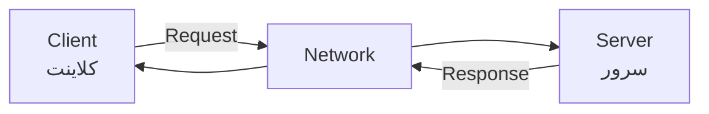
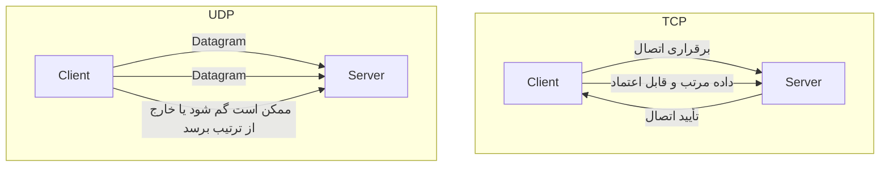
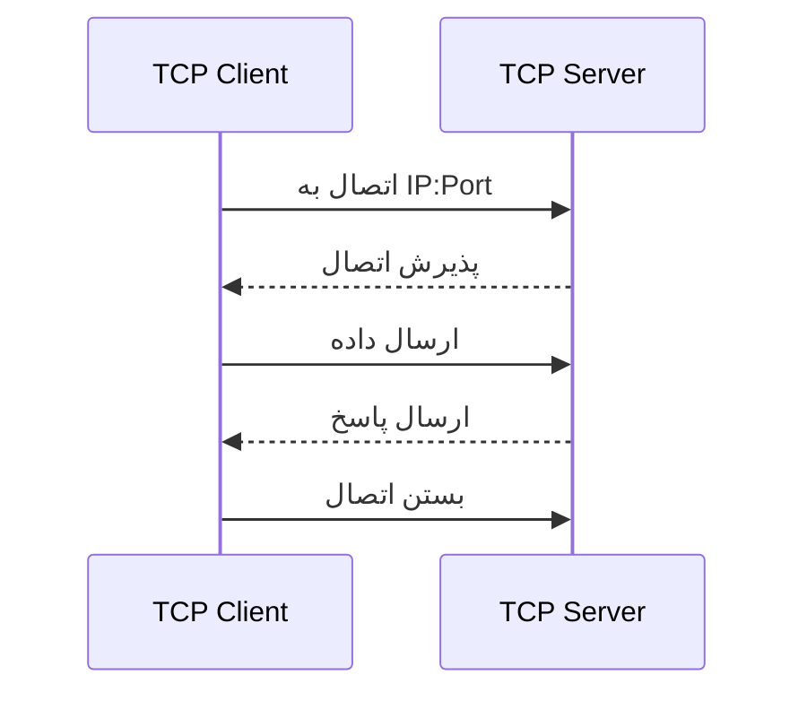
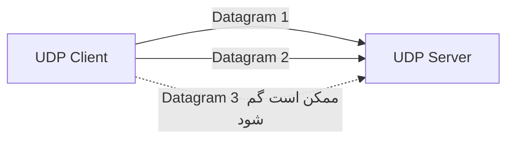
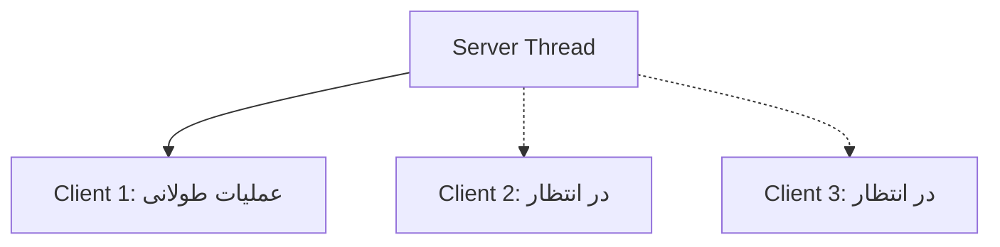
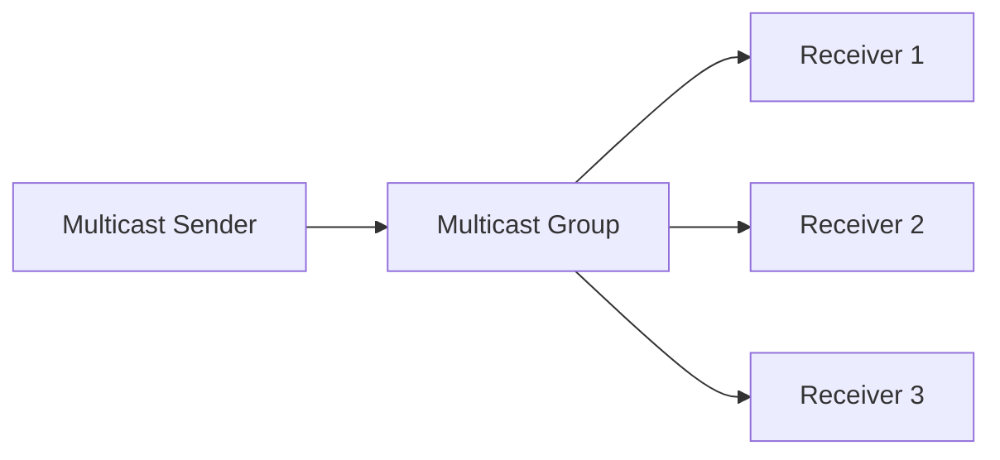
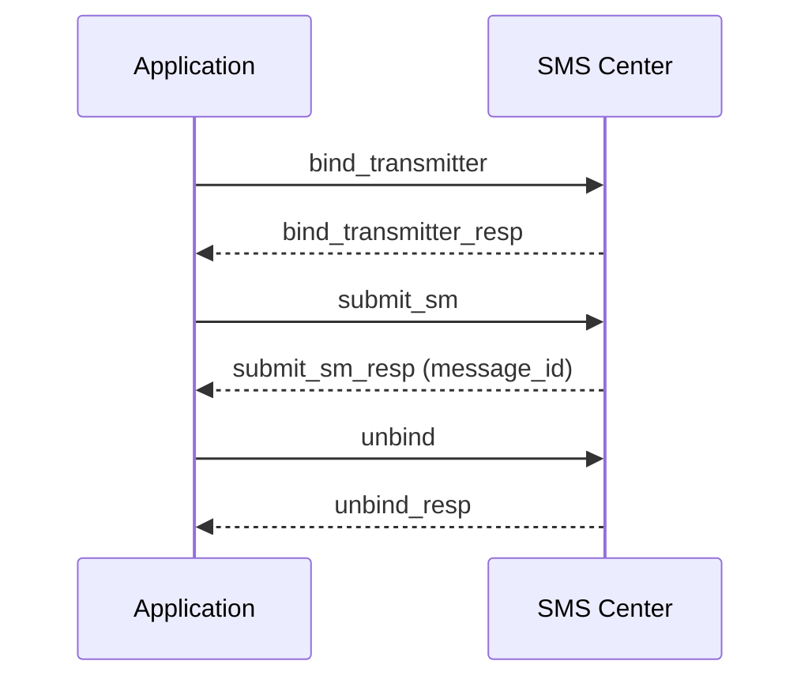

# جزوه جامع برنامه‌نویسی شبکه و Socket در جاوا

> [!summary] تعریف
> **برنامه‌نویسی شبکه‌ای** به برنامه‌ها اجازه می‌دهد از طریق شبکه با یکدیگر ارتباط برقرار کنند، داده بفرستند، داده دریافت کنند و سرویس ارائه دهند.
>
> در جاوا، ابزارهای پایهٔ این حوزه عمدتاً در پکیج‌های `java.net`، `java.io` و `java.nio` قرار دارند.

---

## فهرست مطالب

- [[#بخش ۱ مفاهیم اولیه شبکه]]
- [[#بخش ۲ Socket در جاوا]]
- [[#بخش ۳ Stream Socket و TCP]]
- [[#بخش ۴ Datagram Socket و UDP]]
- [[#بخش ۵ مدیریت چند کلاینت و همزمانی]]
- [[#بخش ۶ ارسال Object از طریق Socket]]
- [[#بخش ۷ Non-blocking I O با Java NIO]]
- [[#بخش ۸ UDP Multicast]]
- [[#بخش ۹ ارسال ایمیل با SMTP]]
- [[#بخش ۱۰ ارسال پیامک با SMPP]]
- [[#بخش ۱۱ امنیت و مدیریت خطا]]
- [[#بخش ۱۲ بهترین شیوه‌ها]]
- [[#جمع‌بندی]]

---

# بخش ۱: مفاهیم اولیه شبکه

## ۱.۱. شبکه چیست؟

**شبکه** مجموعه‌ای از کامپیوترها، سرورها، تلفن‌ها، روترها و سایر دستگاه‌ها است که به یکدیگر متصل شده‌اند تا اطلاعات را تبادل کنند.

شبکه‌ها از نظر اندازه و محدودهٔ جغرافیایی می‌توانند بسیار متفاوت باشند:

| نوع شبکه | نام | توضیح |
|---|---|---|
| `PAN` | Personal Area Network | شبکه شخصی با محدوده بسیار کوچک، مانند Bluetooth |
| `LAN` | Local Area Network | شبکه محلی؛ مانند شبکه یک خانه، شرکت یا دانشگاه |
| `MAN` | Metropolitan Area Network | شبکه در محدوده یک شهر |
| `WAN` | Wide Area Network | شبکه گسترده؛ مانند ارتباط شعب یک سازمان در شهرهای مختلف |
| Internet | اینترنت | بزرگ‌ترین شبکه جهانی |



---

## ۱.۲. آدرس IP و Port

هر دستگاه در شبکه با یک **IP Address** شناسایی می‌شود.

نمونهٔ IPv4:

```text
192.168.1.10
```

نمونهٔ IPv6:

```text
2001:db8:85a3::8a2e:370:7334
```

اما یک IP به‌تنهایی برای شناسایی برنامهٔ مقصد کافی نیست؛ زیرا ممکن است چند برنامه به‌طور همزمان روی یک سرور اجرا شوند. به همین دلیل از **Port** استفاده می‌شود.

```text
IP Address + Port = Socket Endpoint
```

مثال:

```text
127.0.0.1:8080
```

| بخش | معنا |
|---|---|
| `127.0.0.1` | آدرس Loopback یا همان سیستم فعلی |
| `8080` | پورت برنامه یا سرویس |
| `localhost` | نام دامنه‌ای که معمولاً به `127.0.0.1` اشاره می‌کند |

> [!note]
> شماره پورت عددی بین `0` تا `65535` است. پورت‌های `0` تا `1023` معمولاً برای سرویس‌های شناخته‌شده یا سیستمی رزرو شده‌اند.

نمونه‌هایی از پورت‌های رایج:

| سرویس | پورت متداول |
|---|---:|
| HTTP | `80` |
| HTTPS | `443` |
| SSH | `22` |
| SMTP | `25` یا `587` |
| SMTPS | `465` |
| MySQL | `3306` |
| PostgreSQL | `5432` |

---

## ۱.۳. پروتکل‌های شبکه

**Protocol** یا پروتکل، مجموعه‌ای از قوانین و قراردادهاست که نحوه تبادل داده بین دستگاه‌ها را مشخص می‌کند.

دو پروتکل اصلی که در برنامه‌نویسی شبکه جاوا با آن‌ها کار می‌کنیم:

- **TCP**: انتقال قابل اعتماد و اتصال‌گرا
- **UDP**: انتقال سریع، سبک و بدون اتصال

---

## ۱.۴. TCP در برابر UDP

| ویژگی | TCP | UDP |
|---|---|---|
| نوع ارتباط | اتصال‌گرا (*Connection-oriented*) | بدون اتصال (*Connectionless*) |
| تضمین تحویل | دارد | ندارد |
| ترتیب دریافت داده‌ها | تضمین می‌شود | تضمین نمی‌شود |
| امکان ارسال تکراری | مدیریت می‌شود | بر عهده برنامه است |
| سربار | بیشتر | کمتر |
| سرعت | معمولاً کمتر | معمولاً بیشتر |
| کاربرد | HTTP، HTTPS، دیتابیس، فایل، ایمیل | بازی آنلاین، DNS، VoIP، Streaming، Broadcast |



> [!important]
> TCP یک **جریان پیوسته از بایت‌ها** فراهم می‌کند، نه پیام‌های مجزا.  
> بنابراین اگر برنامه پیام‌هایی مانند JSON یا متن خطی منتقل می‌کند، باید خودش مرز پیام‌ها را تعریف کند؛ مثلاً با newline، طول پیام یا یک قالب مشخص.

---

# بخش ۲: Socket در جاوا

## ۲.۱. سوکت چیست؟

**Socket** یک انتزاع نرم‌افزاری برای ارتباط شبکه‌ای است. سوکت به برنامه اجازه می‌دهد به یک مقصد شبکه‌ای متصل شود یا ارتباط‌های ورودی را دریافت کند.

در یک ارتباط TCP معمولی:



هر اتصال TCP با ترکیبی از آدرس‌ها و پورت‌های دو طرف مشخص می‌شود:

```text
Client IP:Client Port  <---->  Server IP:Server Port
```

برای مثال:

```text
192.168.1.20:52104  <---->  192.168.1.10:8080
```

---

## ۲.۲. کلاس‌های اصلی شبکه در جاوا

| کلاس | کاربرد |
|---|---|
| `Socket` | ارتباط TCP در سمت کلاینت یا اتصال پذیرفته‌شده در سرور |
| `ServerSocket` | گوش‌دادن به اتصال‌های TCP ورودی |
| `DatagramSocket` | ارسال و دریافت Datagram در UDP |
| `DatagramPacket` | بسته داده UDP |
| `InetAddress` | نمایش آدرس IP یا نام میزبان |
| `MulticastSocket` | دریافت یا ارسال داده برای گروه Multicast |
| `SocketChannel` | کانال TCP در NIO |
| `ServerSocketChannel` | کانال سرور TCP در NIO |
| `Selector` | مدیریت چند Channel غیرمسدودکننده با یک یا چند Thread |

---

# بخش ۳: Stream Socket و TCP

## ۳.۱. سرور TCP چگونه کار می‌کند؟

سرور TCP مراحل زیر را طی می‌کند:

1. ساخت `ServerSocket` روی یک پورت مشخص
2. انتظار برای اتصال با `accept()`
3. دریافت یک `Socket` جدید برای هر کلاینت
4. خواندن یا نوشتن داده از طریق Streamهای سوکت
5. بستن اتصال و منابع

```java
ServerSocket serverSocket = new ServerSocket(6666);

Socket clientSocket = serverSocket.accept();
```

> [!note]
> متد `accept()` به‌صورت پیش‌فرض **Blocking** است؛ یعنی تا زمانی که کلاینتی متصل نشود، Thread جاری منتظر می‌ماند.

---

## ۳.۲. مثال: سرور ساده TCP

```java
import java.io.BufferedReader;
import java.io.IOException;
import java.io.InputStreamReader;
import java.net.ServerSocket;
import java.net.Socket;
import java.nio.charset.StandardCharsets;

public class SimpleTcpServer {

    public static void main(String[] args) {
        int port = 6666;

        try (ServerSocket serverSocket = new ServerSocket(port)) {
            System.out.println("Server is listening on port " + port);

            while (true) {
                try (Socket socket = serverSocket.accept();
                     BufferedReader reader = new BufferedReader(
                             new InputStreamReader(
                                     socket.getInputStream(),
                                     StandardCharsets.UTF_8
                             )
                     )) {

                    System.out.println(
                            "New client connected: "
                            + socket.getRemoteSocketAddress()
                    );

                    String message = reader.readLine();

                    if (message != null) {
                        System.out.println("Received: " + message);
                    }
                }
            }

        } catch (IOException exception) {
            exception.printStackTrace();
        }
    }
}
```

---

## ۳.۳. مثال: کلاینت ساده TCP

```java
import java.io.IOException;
import java.io.OutputStreamWriter;
import java.io.PrintWriter;
import java.net.Socket;
import java.nio.charset.StandardCharsets;

public class SimpleTcpClient {

    public static void main(String[] args) {
        String hostname = "localhost";
        int port = 6666;

        try (
            Socket socket = new Socket(hostname, port);
            PrintWriter writer = new PrintWriter(
                    new OutputStreamWriter(
                            socket.getOutputStream(),
                            StandardCharsets.UTF_8
                    ),
                    true
            )
        ) {
            writer.println("Hello, Server!");

        } catch (IOException exception) {
            System.err.println("Network error: " + exception.getMessage());
        }
    }
}
```

برای اجرای مثال:

1. ابتدا `SimpleTcpServer` را اجرا کنید.
2. سپس `SimpleTcpClient` را اجرا کنید.
3. پیام ارسالی در خروجی سرور نمایش داده می‌شود.

---

## ۳.۴. سرور Echo با TCP

**Echo Server** داده دریافتی از کلاینت را مجدداً برای همان کلاینت ارسال می‌کند.

```java
import java.io.BufferedReader;
import java.io.BufferedWriter;
import java.io.IOException;
import java.io.InputStreamReader;
import java.io.OutputStreamWriter;
import java.net.ServerSocket;
import java.net.Socket;
import java.nio.charset.StandardCharsets;

public class TcpEchoServer {

    public static void main(String[] args) {
        int port = 8080;

        try (ServerSocket serverSocket = new ServerSocket(port)) {
            System.out.println("Echo server started on port " + port);

            while (true) {
                try (
                    Socket socket = serverSocket.accept();
                    BufferedReader reader = new BufferedReader(
                            new InputStreamReader(
                                    socket.getInputStream(),
                                    StandardCharsets.UTF_8
                            )
                    );
                    BufferedWriter writer = new BufferedWriter(
                            new OutputStreamWriter(
                                    socket.getOutputStream(),
                                    StandardCharsets.UTF_8
                            )
                    )
                ) {
                    String line;

                    while ((line = reader.readLine()) != null) {
                        System.out.println("Received: " + line);

                        writer.write("Echo: " + line);
                        writer.newLine();
                        writer.flush();

                        if ("bye".equalsIgnoreCase(line)) {
                            break;
                        }
                    }
                }
            }

        } catch (IOException exception) {
            exception.printStackTrace();
        }
    }
}
```

---

## ۳.۵. Timeouts در TCP

بدون Timeout، عملیات شبکه ممکن است برای مدت نامشخصی منتظر بمانند. برای جلوگیری از این وضعیت، Timeout تنظیم کنید.

```java
import java.net.Socket;

Socket socket = new Socket();

socket.connect(
        new java.net.InetSocketAddress("localhost", 8080),
        5_000
);

socket.setSoTimeout(10_000);
```

| تنظیم | کاربرد |
|---|---|
| `connect(..., timeout)` | حداکثر زمان انتظار برای برقراری اتصال |
| `setSoTimeout(...)` | حداکثر زمان انتظار برای خواندن داده |
| `setKeepAlive(true)` | فعال‌سازی مکانیزم TCP Keep-Alive در سطح سیستم‌عامل |

> [!warning]
> Timeout جایگزین طراحی درست پروتکل و مدیریت خطا نیست؛ اما برای جلوگیری از گیرکردن Threadها ضروری است.

---

# بخش ۴: Datagram Socket و UDP

## ۴.۱. مفهوم Datagram

در UDP، داده‌ها در قالب **Datagram Packet** منتقل می‌شوند. هر Datagram به‌طور مستقل ارسال می‌شود و شامل موارد زیر است:

- داده‌ها
- آدرس IP مقصد
- پورت مقصد

برخلاف TCP، ابتدا اتصال دائمی برقرار نمی‌شود.



---

## ۴.۲. مثال: سرور ساده UDP

```java
import java.io.IOException;
import java.net.DatagramPacket;
import java.net.DatagramSocket;
import java.nio.charset.StandardCharsets;

public class SimpleUdpServer {

    public static void main(String[] args) {
        int port = 4445;
        byte[] buffer = new byte[1024];

        try (DatagramSocket socket = new DatagramSocket(port)) {
            System.out.println("UDP server is listening on port " + port);

            while (true) {
                DatagramPacket packet =
                        new DatagramPacket(buffer, buffer.length);

                socket.receive(packet);

                String received = new String(
                        packet.getData(),
                        packet.getOffset(),
                        packet.getLength(),
                        StandardCharsets.UTF_8
                );

                System.out.printf(
                        "Received from %s:%d -> %s%n",
                        packet.getAddress().getHostAddress(),
                        packet.getPort(),
                        received
                );

                if ("bye".equalsIgnoreCase(received)) {
                    break;
                }
            }

        } catch (IOException exception) {
            exception.printStackTrace();
        }
    }
}
```

---

## ۴.۳. مثال: کلاینت ساده UDP

```java
import java.io.IOException;
import java.net.DatagramPacket;
import java.net.DatagramSocket;
import java.net.InetAddress;
import java.nio.charset.StandardCharsets;

public class SimpleUdpClient {

    public static void main(String[] args) {
        String hostname = "localhost";
        int port = 4445;

        try (DatagramSocket socket = new DatagramSocket()) {
            InetAddress address = InetAddress.getByName(hostname);

            byte[] data = "Hello, UDP Server!".getBytes(
                    StandardCharsets.UTF_8
            );

            DatagramPacket packet = new DatagramPacket(
                    data,
                    data.length,
                    address,
                    port
            );

            socket.send(packet);

            System.out.println("Message sent.");

        } catch (IOException exception) {
            exception.printStackTrace();
        }
    }
}
```

> [!important]
> در UDP، اگر تحویل پیام، ترتیب پیام‌ها یا جلوگیری از تکرار برای برنامه حیاتی باشد، باید این موارد را در سطح برنامه پیاده‌سازی کنید یا از TCP استفاده کنید.

---

# بخش ۵: مدیریت چند کلاینت و همزمانی

## ۵.۱. مسئله سرور تک‌نخی

در سرور تک‌نخی، اگر یک کلاینت مدت زیادی اتصال را باز نگه دارد یا ارسال داده را متوقف کند، سرور ممکن است نتواند به کلاینت‌های دیگر پاسخ دهد.



برای حل این مسئله، هر اتصال باید به‌صورت مستقل مدیریت شود.

---

## ۵.۲. استفاده از Thread برای هر کلاینت

روش آموزشی و ساده این است که برای هر کلاینت یک Thread جدید ایجاد کنیم.

```java
import java.io.BufferedReader;
import java.io.IOException;
import java.io.InputStreamReader;
import java.io.OutputStreamWriter;
import java.io.PrintWriter;
import java.net.ServerSocket;
import java.net.Socket;
import java.nio.charset.StandardCharsets;

public class MultiThreadedTcpServer {

    public static void main(String[] args) {
        int port = 8080;

        try (ServerSocket serverSocket = new ServerSocket(port)) {
            System.out.println("Server is listening on port " + port);

            while (true) {
                Socket socket = serverSocket.accept();

                Thread thread = new Thread(
                        new ClientHandler(socket)
                );

                thread.start();
            }

        } catch (IOException exception) {
            exception.printStackTrace();
        }
    }

    private static class ClientHandler implements Runnable {

        private final Socket socket;

        private ClientHandler(Socket socket) {
            this.socket = socket;
        }

        @Override
        public void run() {
            try (
                socket;
                BufferedReader reader = new BufferedReader(
                        new InputStreamReader(
                                socket.getInputStream(),
                                StandardCharsets.UTF_8
                        )
                );
                PrintWriter writer = new PrintWriter(
                        new OutputStreamWriter(
                                socket.getOutputStream(),
                                StandardCharsets.UTF_8
                        ),
                        true
                )
            ) {
                String text;

                while ((text = reader.readLine()) != null) {
                    System.out.println(
                            socket.getRemoteSocketAddress() + ": " + text
                    );

                    writer.println("Echo: " + text);

                    if ("bye".equalsIgnoreCase(text)) {
                        break;
                    }
                }

            } catch (IOException exception) {
                System.err.println("Client connection error: "
                        + exception.getMessage());
            }
        }
    }
}
```

> [!warning]
> ایجاد یک Thread واقعی برای هر اتصال، در تعداد زیاد کلاینت‌ها مقیاس‌پذیر نیست. هزاران اتصال هم‌زمان می‌توانند باعث مصرف زیاد حافظه و Context Switching شوند.

---

## ۵.۳. استفاده از `ExecutorService`

به‌جای ساخت Thread نامحدود، از Thread Pool استفاده کنید.

```java
import java.io.IOException;
import java.net.ServerSocket;
import java.net.Socket;
import java.util.concurrent.ExecutorService;
import java.util.concurrent.Executors;

public class ExecutorTcpServer {

    public static void main(String[] args) {
        ExecutorService executor = Executors.newFixedThreadPool(100);

        try (ServerSocket serverSocket = new ServerSocket(8080)) {
            System.out.println("Server started on port 8080");

            while (!Thread.currentThread().isInterrupted()) {
                Socket socket = serverSocket.accept();

                executor.submit(() -> {
                    try (socket) {
                        // پردازش درخواست کلاینت
                        System.out.println(
                                "Handling: " + socket.getRemoteSocketAddress()
                        );
                    } catch (IOException exception) {
                        System.err.println(exception.getMessage());
                    }
                });
            }

        } catch (IOException exception) {
            exception.printStackTrace();

        } finally {
            executor.shutdown();
        }
    }
}
```

---

## ۵.۴. Virtual Thread در Java 21+

برای برنامه‌های I/O-bound مانند سرورهای Socket، **Virtual Thread**ها انتخاب مدرن و بسیار مناسبی هستند.

```java
import java.io.IOException;
import java.net.ServerSocket;
import java.net.Socket;
import java.util.concurrent.ExecutorService;
import java.util.concurrent.Executors;

public class VirtualThreadTcpServer {

    public static void main(String[] args) {
        try (
            ServerSocket serverSocket = new ServerSocket(8080);
            ExecutorService executor = Executors.newVirtualThreadPerTaskExecutor()
        ) {
            System.out.println("Server started on port 8080");

            while (true) {
                Socket socket = serverSocket.accept();

                executor.submit(() -> {
                    try (socket) {
                        System.out.println(
                                "Connected: " + socket.getRemoteSocketAddress()
                        );

                        // پردازش ارتباط با کلاینت
                    } catch (IOException exception) {
                        System.err.println(exception.getMessage());
                    }
                });
            }

        } catch (IOException exception) {
            exception.printStackTrace();
        }
    }
}
```

> [!tip]
> برای بسیاری از سرورهای مبتنی بر I/O در Java 21 یا بالاتر، Virtual Threadها راه‌حلی ساده‌تر از مدل سنتی Thread Pool هستند.

---

# بخش ۶: ارسال Object از طریق Socket

## ۶.۱. Serialization چیست؟

**Serialization** فرایند تبدیل یک Object جاوا به دنباله‌ای از بایت‌هاست تا بتوان آن را ذخیره یا از طریق شبکه ارسال کرد.

برای قابل‌سریال‌سازی بودن یک کلاس، باید `Serializable` را پیاده‌سازی کند.

```java
import java.io.Serializable;

public class Person implements Serializable {

    private static final long serialVersionUID = 1L;

    private final String name;
    private final int age;

    public Person(String name, int age) {
        this.name = name;
        this.age = age;
    }

    @Override
    public String toString() {
        return "Person{name='%s', age=%d}".formatted(name, age);
    }
}
```

> [!note]
> هر کلاس `public` باید در فایل جداگانه‌ای با نام همان کلاس قرار بگیرد؛ برای مثال:
>
> ```text
> Person.java
> ObjectTcpServer.java
> ObjectTcpClient.java
> ```

---

## ۶.۲. سرور دریافت‌کننده Object

```java
import java.io.IOException;
import java.io.ObjectInputStream;
import java.net.ServerSocket;
import java.net.Socket;

public class ObjectTcpServer {

    public static void main(String[] args) {
        try (
            ServerSocket serverSocket = new ServerSocket(6666);
            Socket socket = serverSocket.accept();
            ObjectInputStream input =
                    new ObjectInputStream(socket.getInputStream())
        ) {
            System.out.println("Client connected.");

            Person person = (Person) input.readObject();

            System.out.println("Received: " + person);

        } catch (IOException | ClassNotFoundException exception) {
            exception.printStackTrace();
        }
    }
}
```

---

## ۶.۳. کلاینت ارسال‌کننده Object

```java
import java.io.IOException;
import java.io.ObjectOutputStream;
import java.net.Socket;

public class ObjectTcpClient {

    public static void main(String[] args) {
        try (
            Socket socket = new Socket("localhost", 6666);
            ObjectOutputStream output =
                    new ObjectOutputStream(socket.getOutputStream())
        ) {
            Person person = new Person("John", 25);

            output.writeObject(person);
            output.flush();

        } catch (IOException exception) {
            exception.printStackTrace();
        }
    }
}
```

> [!danger] خطر امنیتی Deserialization
> دادهٔ سریال‌شده‌ای که از یک منبع غیرقابل اعتماد دریافت می‌شود را مستقیماً با `ObjectInputStream.readObject()` باز نکنید.  
> **Java Deserialization** می‌تواند در شرایطی زمینه آسیب‌پذیری امنیتی ایجاد کند.
>
> برای APIها و ارتباط‌های بین سرویس‌ها، معمولاً JSON، Protocol Buffers یا Avro گزینه‌های امن‌تر و قابل‌تکامل‌تری هستند.

---

# بخش ۷: Non-blocking I/O با Java NIO

## ۷.۱. Blocking در برابر Non-blocking

در I/O مسدودکننده، یک Thread هنگام انتظار برای داده متوقف می‌شود:

```text
Thread 1 → منتظر داده از Client 1
```

در I/O غیرمسدودکننده، یک Thread می‌تواند وضعیت چندین اتصال را بررسی و مدیریت کند:

```text
Thread 1 → Client 1, Client 2, Client 3, ...
```

کلاس‌های مهم NIO:

| کلاس | کاربرد |
|---|---|
| `ServerSocketChannel` | سرور TCP غیرمسدودکننده |
| `SocketChannel` | اتصال TCP غیرمسدودکننده |
| `ByteBuffer` | نگهداری بایت‌های ورودی و خروجی |
| `Selector` | تشخیص Channelهای آماده برای عملیات |
| `SelectionKey` | وضعیت ثبت‌شده یک Channel در Selector |

---

## ۷.۲. رویدادهای SelectionKey

| رویداد | معنا |
|---|---|
| `OP_ACCEPT` | اتصال جدید آماده پذیرش است |
| `OP_CONNECT` | اتصال کلاینت آماده تکمیل است |
| `OP_READ` | داده‌ای برای خواندن وجود دارد |
| `OP_WRITE` | Channel آماده نوشتن است |

---

## ۷.۳. مثال: NIO Echo Server

```java
import java.io.IOException;
import java.net.InetSocketAddress;
import java.nio.ByteBuffer;
import java.nio.channels.SelectionKey;
import java.nio.channels.Selector;
import java.nio.channels.ServerSocketChannel;
import java.nio.channels.SocketChannel;
import java.nio.charset.StandardCharsets;
import java.util.Iterator;

public class NonBlockingEchoServer {

    public static void main(String[] args) {
        try (
            Selector selector = Selector.open();
            ServerSocketChannel serverChannel = ServerSocketChannel.open()
        ) {
            serverChannel.bind(new InetSocketAddress(8080));
            serverChannel.configureBlocking(false);
            serverChannel.register(selector, SelectionKey.OP_ACCEPT);

            System.out.println("NIO server is listening on port 8080");

            while (true) {
                selector.select();

                Iterator<SelectionKey> keys =
                        selector.selectedKeys().iterator();

                while (keys.hasNext()) {
                    SelectionKey key = keys.next();
                    keys.remove();

                    if (!key.isValid()) {
                        continue;
                    }

                    if (key.isAcceptable()) {
                        acceptClient(serverChannel, selector);
                    }

                    if (key.isReadable()) {
                        readFromClient(key);
                    }
                }
            }

        } catch (IOException exception) {
            exception.printStackTrace();
        }
    }

    private static void acceptClient(
            ServerSocketChannel serverChannel,
            Selector selector
    ) throws IOException {

        SocketChannel clientChannel = serverChannel.accept();

        if (clientChannel == null) {
            return;
        }

        clientChannel.configureBlocking(false);
        clientChannel.register(selector, SelectionKey.OP_READ);

        System.out.println(
                "Client connected: " + clientChannel.getRemoteAddress()
        );
    }

    private static void readFromClient(SelectionKey key)
            throws IOException {

        SocketChannel clientChannel = (SocketChannel) key.channel();

        ByteBuffer buffer = ByteBuffer.allocate(1024);

        int bytesRead = clientChannel.read(buffer);

        if (bytesRead == -1) {
            clientChannel.close();
            return;
        }

        if (bytesRead == 0) {
            return;
        }

        buffer.flip();

        String message = StandardCharsets.UTF_8
                .decode(buffer)
                .toString();

        System.out.println("Received: " + message);

        ByteBuffer response = StandardCharsets.UTF_8.encode(
                "Echo: " + message
        );

        while (response.hasRemaining()) {
            clientChannel.write(response);
        }
    }
}
```

> [!warning]
> نمونه بالا آموزشی است. در یک سرور واقعی NIO باید مواردی مانند **Partial Read**، **Partial Write**، صف خروجی، فریم‌بندی پیام‌ها، مدیریت `OP_WRITE` و محدودیت اندازه پیام را نیز پیاده‌سازی کنید.

---

# بخش ۸: UDP و Multicast

## ۸.۱. Multicast چیست؟

در **Multicast**، یک فرستنده پیام را به یک آدرس گروهی ارسال می‌کند و تمام عضوهای آن گروه می‌توانند پیام را دریافت کنند.



بازهٔ IPv4 Multicast:

```text
224.0.0.0 تا 239.255.255.255
```

نمونهٔ آدرس گروهی:

```text
230.0.0.0
```

---

## ۸.۲. دریافت‌کننده Multicast

```java
import java.io.IOException;
import java.net.DatagramPacket;
import java.net.InetAddress;
import java.net.InetSocketAddress;
import java.net.MulticastSocket;
import java.net.NetworkInterface;
import java.nio.charset.StandardCharsets;

public class MulticastReceiver {

    public static void main(String[] args) {
        int port = 4446;
        InetAddress group;

        try {
            group = InetAddress.getByName("230.0.0.0");

            try (MulticastSocket socket = new MulticastSocket(port)) {
                NetworkInterface networkInterface =
                        NetworkInterface.getByInetAddress(
                                InetAddress.getLocalHost()
                        );

                socket.joinGroup(
                        new InetSocketAddress(group, port),
                        networkInterface
                );

                byte[] buffer = new byte[1024];

                System.out.println("Listening to multicast group...");

                while (true) {
                    DatagramPacket packet =
                            new DatagramPacket(buffer, buffer.length);

                    socket.receive(packet);

                    String received = new String(
                            packet.getData(),
                            packet.getOffset(),
                            packet.getLength(),
                            StandardCharsets.UTF_8
                    );

                    System.out.println("Received: " + received);

                    if ("end".equalsIgnoreCase(received)) {
                        break;
                    }
                }

                socket.leaveGroup(
                        new InetSocketAddress(group, port),
                        networkInterface
                );
            }

        } catch (IOException exception) {
            exception.printStackTrace();
        }
    }
}
```

---

## ۸.۳. فرستنده Multicast

```java
import java.io.IOException;
import java.net.DatagramPacket;
import java.net.InetAddress;
import java.net.MulticastSocket;
import java.nio.charset.StandardCharsets;

public class MulticastSender {

    public static void main(String[] args) {
        String groupAddress = "230.0.0.0";
        int port = 4446;

        try (
            MulticastSocket socket = new MulticastSocket()
        ) {
            InetAddress group = InetAddress.getByName(groupAddress);

            send(socket, group, port, "Hello, Multicast Group!");
            send(socket, group, port, "end");

        } catch (IOException exception) {
            exception.printStackTrace();
        }
    }

    private static void send(
            MulticastSocket socket,
            InetAddress group,
            int port,
            String message
    ) throws IOException {

        byte[] data = message.getBytes(StandardCharsets.UTF_8);

        DatagramPacket packet = new DatagramPacket(
                data,
                data.length,
                group,
                port
        );

        socket.send(packet);
    }
}
```

> [!note]
> Multicast ممکن است در برخی شبکه‌های سازمانی، محیط‌های Cloud، Docker یا تنظیمات Router محدود یا غیرفعال باشد.

---

# بخش ۹: ارسال ایمیل با SMTP

## ۹.۱. SMTP چیست؟

**SMTP** مخفف **Simple Mail Transfer Protocol** و پروتکل استاندارد ارسال ایمیل است.

فرمان‌های رایج SMTP:

| فرمان | کاربرد |
|---|---|
| `EHLO` | معرفی کلاینت و درخواست قابلیت‌های سرور |
| `MAIL FROM` | تعیین فرستنده |
| `RCPT TO` | تعیین گیرنده |
| `DATA` | شروع ارسال محتوای ایمیل |
| `QUIT` | پایان جلسه |

> [!important]
> پورت `25` عمدتاً برای انتقال ایمیل میان سرورها استفاده می‌شود و در بسیاری از سرویس‌دهنده‌ها برای کلاینت‌ها محدود است.  
> برای ارسال ایمیل از برنامه معمولاً از **587 با STARTTLS** یا **465 با TLS ضمنی** استفاده می‌شود.

---

## ۹.۲. نمونه آموزشی SMTP خام

کد زیر صرفاً سازوکار متنی SMTP را نشان می‌دهد و برای ارسال واقعی به سرویس‌های مدرن کافی نیست؛ زیرا بیشتر آن‌ها به TLS و احراز هویت نیاز دارند.

```java
import java.io.BufferedReader;
import java.io.BufferedWriter;
import java.io.IOException;
import java.io.InputStreamReader;
import java.io.OutputStreamWriter;
import java.net.Socket;
import java.nio.charset.StandardCharsets;

public class BasicSmtpClient {

    public static void main(String[] args) {
        String host = "smtp.example.com";
        int port = 25;

        try (
            Socket socket = new Socket(host, port);
            BufferedReader reader = new BufferedReader(
                    new InputStreamReader(
                            socket.getInputStream(),
                            StandardCharsets.UTF_8
                    )
            );
            BufferedWriter writer = new BufferedWriter(
                    new OutputStreamWriter(
                            socket.getOutputStream(),
                            StandardCharsets.UTF_8
                    )
            )
        ) {
            readResponse(reader);

            sendCommand(writer, "EHLO example.com");
            readResponse(reader);

            sendCommand(writer, "MAIL FROM:<sender@example.com>");
            readResponse(reader);

            sendCommand(writer, "RCPT TO:<recipient@example.com>");
            readResponse(reader);

            sendCommand(writer, "DATA");
            readResponse(reader);

            writer.write("Subject: Test Email\r\n");
            writer.write("From: sender@example.com\r\n");
            writer.write("To: recipient@example.com\r\n");
            writer.write("Content-Type: text/plain; charset=UTF-8\r\n");
            writer.write("\r\n");
            writer.write("This is a test email sent using Java.\r\n");
            writer.write(".\r\n");
            writer.flush();

            readResponse(reader);

            sendCommand(writer, "QUIT");
            readResponse(reader);

        } catch (IOException exception) {
            exception.printStackTrace();
        }
    }

    private static void sendCommand(
            BufferedWriter writer,
            String command
    ) throws IOException {

        writer.write(command + "\r\n");
        writer.flush();

        System.out.println("C: " + command);
    }

    private static void readResponse(
            BufferedReader reader
    ) throws IOException {

        String response = reader.readLine();
        System.out.println("S: " + response);
    }
}
```

> [!warning]
> پاسخ SMTP می‌تواند چندخطی باشد؛ بنابراین خواندن صرفاً یک خط، برای یک Client کامل کافی نیست. همچنین در متن ایمیل باید `.` ابتدای خط به‌درستی Escape شود (*dot-stuffing*).

---

## ۹.۳. روش پیشنهادی ارسال ایمیل

در پروژه‌های واقعی، به‌جای پیاده‌سازی دستی SMTP از کتابخانه‌های استاندارد مانند **Jakarta Mail** استفاده کنید. این کتابخانه موارد زیر را مدیریت می‌کند:

- TLS و STARTTLS
- احراز هویت SMTP
- پیوست فایل
- قالب MIME
- HTML Email
- چند گیرنده‌ای بودن
- Charset و Headerها

---

# بخش ۱۰: ارسال پیامک با SMPP

## ۱۰.۱. SMPP چیست؟

**SMPP** مخفف **Short Message Peer-to-Peer** است؛ پروتکلی برای ارتباط نرم‌افزارها با مراکز پیام کوتاه یا **SMSC**.

جریان کلی:



فرمان‌های پرکاربرد:

| دستور | کاربرد |
|---|---|
| `bind_transmitter` | ایجاد جلسه برای ارسال پیام |
| `bind_receiver` | ایجاد جلسه برای دریافت پیام |
| `bind_transceiver` | ارسال و دریافت در یک جلسه |
| `submit_sm` | ثبت درخواست ارسال پیامک |
| `deliver_sm` | دریافت پیام یا Delivery Receipt |
| `enquire_link` | بررسی زنده بودن اتصال |
| `unbind` | پایان جلسه |

---

## ۱۰.۲. نکته مهم درباره پیاده‌سازی خام SMPP

SMPP یک پروتکل باینری با ساختار دقیق PDU است. بنابراین این بخش از کد:

```java
byte[] submitSm = { /* ... */ };
```

برای یک برنامه عملی کافی نیست؛ زیرا باید مواردی مانند زیر با دقت ساخته و پردازش شوند:

- طول PDU
- شناسه فرمان (*Command ID*)
- وضعیت پاسخ (*Command Status*)
- شماره ترتیبی (*Sequence Number*)
- فیلدهای C-Octet String
- Encoding پیام
- Delivery Receipt
- Reconnect و Keep-Alive

> [!tip]
> برای اتصال عملی به SMPP، از کتابخانه‌های تثبیت‌شده مانند **JSMPP** یا **Cloudhopper** استفاده کنید؛ پیاده‌سازی مستقیم پروتکل باینری تنها در صورت نیاز تخصصی توصیه می‌شود.

---

## ۱۰.۳. نمونه ساختاری با JSMPP

```java
import org.jsmpp.bean.Alphabet;
import org.jsmpp.bean.BindType;
import org.jsmpp.bean.ESMClass;
import org.jsmpp.bean.GeneralDataCoding;
import org.jsmpp.bean.MessageClass;
import org.jsmpp.bean.NumberingPlanIndicator;
import org.jsmpp.bean.TypeOfNumber;
import org.jsmpp.session.SMPPSession;

import java.nio.charset.StandardCharsets;

public class SmppClientWithLibrary {

    public static void main(String[] args) {
        SMPPSession session = new SMPPSession();

        try {
            session.connectAndBind(
                    "smpp.example.com",
                    2775,
                    BindType.BIND_TX,
                    "username",
                    "password",
                    "systemType",
                    TypeOfNumber.UNKNOWN,
                    NumberingPlanIndicator.UNKNOWN,
                    null
            );

            String messageId = session.submitShortMessage(
                    "CMT",
                    TypeOfNumber.INTERNATIONAL,
                    NumberingPlanIndicator.ISDN,
                    "12345",
                    TypeOfNumber.INTERNATIONAL,
                    NumberingPlanIndicator.ISDN,
                    "989121234567",
                    new ESMClass(),
                    (byte) 0,
                    (byte) 1,
                    null,
                    null,
                    null,
                    (byte) 0,
                    new GeneralDataCoding(
                            Alphabet.ALPHA_DEFAULT,
                            MessageClass.CLASS1,
                            false
                    ),
                    (byte) 0,
                    "Hello from Java".getBytes(StandardCharsets.UTF_8)
            );

            System.out.println("Message submitted. ID: " + messageId);

        } catch (Exception exception) {
            exception.printStackTrace();

        } finally {
            try {
                session.unbindAndClose();
            } catch (Exception ignored) {
                // Session may not have been established.
            }
        }
    }
}
```

> [!note]
> پیکربندی واقعی مانند Host، Port، نام کاربری، رمز عبور، نوع Encoding و فرمت شماره تلفن وابسته به ارائه‌دهنده سرویس پیامک است.

---

# بخش ۱۱: امنیت و مدیریت خطا

## ۱۱.۱. استفاده از TLS/SSL

ارسال اطلاعات حساس از طریق `Socket` ساده خطرناک است؛ زیرا داده‌ها ممکن است در مسیر شنود شوند.

برای ارتباط امن می‌توان از موارد زیر استفاده کرد:

| ابزار | کاربرد |
|---|---|
| `SSLSocket` | کلاینت TCP رمزنگاری‌شده |
| `SSLServerSocket` | سرور TCP رمزنگاری‌شده |
| HTTPS | ارتباط HTTP روی TLS |
| STARTTLS | ارتقای اتصال ساده به اتصال رمزنگاری‌شده؛ مانند SMTP روی پورت 587 |

نمونه ساخت SSLSocket:

```java
import javax.net.ssl.SSLSocket;
import javax.net.ssl.SSLSocketFactory;
import java.io.IOException;

public class SecureSocketClient {

    public static void main(String[] args) {
        SSLSocketFactory factory =
                (SSLSocketFactory) SSLSocketFactory.getDefault();

        try (SSLSocket socket =
                     (SSLSocket) factory.createSocket(
                             "example.com",
                             443
                     )) {

            socket.startHandshake();

            System.out.println(
                    "TLS connected: "
                    + socket.getSession().getProtocol()
            );

        } catch (IOException exception) {
            exception.printStackTrace();
        }
    }
}
```

> [!warning]
> در محیط عملی باید اعتبار گواهی، نام میزبان، نسخه TLS و Trust Store به‌درستی مدیریت شوند. برای اتصال امن هرگز SSL Certificate Validation را غیرفعال نکنید.

---

## ۱۱.۲. خطاهای متداول شبکه

| Exception | مفهوم |
|---|---|
| `UnknownHostException` | نام میزبان قابل تبدیل به IP نیست |
| `ConnectException` | اتصال رد شده یا سرویس مقصد در دسترس نیست |
| `SocketTimeoutException` | زمان انتظار اتصال یا خواندن تمام شده است |
| `BindException` | پورت قبلاً استفاده شده یا مجوز Bind وجود ندارد |
| `EOFException` | اتصال پیش از دریافت داده مورد انتظار بسته شده است |
| `SocketException` | خطای عمومی در سوکت، مانند بسته شدن اتصال |
| `IOException` | خطای عمومی ورودی/خروجی شبکه |

---

## ۱۱.۳. اصول مدیریت خطا

1. **Timeout** تعریف کنید.
2. اتصال‌های ناموفق را با سیاست **Retry** کنترل‌شده مدیریت کنید.
3. برای Retry از **Exponential Backoff** استفاده کنید.
4. خطاها را با اطلاعات کافی Log کنید؛ اما داده حساس مانند رمز عبور یا Token را ثبت نکنید.
5. تمام Streamها، Socketها و Selectorها را با `try-with-resources` ببندید.
6. اندازه پیام ورودی را محدود کنید.
7. داده ورودی شبکه را نامعتبر فرض کنید و اعتبارسنجی انجام دهید.

نمونه‌ای از Exponential Backoff:

```text
تلاش اول: 1 ثانیه
تلاش دوم: 2 ثانیه
تلاش سوم: 4 ثانیه
تلاش چهارم: 8 ثانیه
```

---

# بخش ۱۲: بهترین شیوه‌ها

## ۱۲.۱. Charset را صریح تعیین کنید

```java
new InputStreamReader(
        socket.getInputStream(),
        StandardCharsets.UTF_8
);
```

از تکیه بر Charset پیش‌فرض سیستم‌عامل پرهیز کنید.

---

## ۱۲.۲. مرز پیام‌ها را مشخص کنید

چون TCP فقط Stream بایت است، باید تعیین کنید پیام کجا تمام می‌شود.

روش‌های رایج:

| روش | نمونه |
|---|---|
| جداکننده | هر پیام با `\n` تمام شود |
| طول پیام | ابتدا طول پیام، سپس داده |
| قالب ساخت‌یافته | HTTP، WebSocket، Protocol Buffers |
| پایان اتصال | بستن Socket به‌معنای پایان پیام |

---

## ۱۲.۳. از ساخت Thread بدون محدودیت پرهیز کنید

```java
// برای تعداد زیاد کلاینت‌ها مناسب نیست
new Thread(clientHandler).start();
```

جایگزین‌ها:

```java
Executors.newFixedThreadPool(100);
```

یا در Java 21+:

```java
Executors.newVirtualThreadPerTaskExecutor();
```

---

## ۱۲.۴. داده‌های غیرقابل اعتماد را اعتبارسنجی کنید

هر داده دریافتی از شبکه می‌تواند مخرب، ناقص یا غیرمنتظره باشد.

موارد مهم:

- اعتبارسنجی طول داده
- محدودکردن اندازه Buffer
- اعتبارسنجی فرمت پیام
- جلوگیری از Deserialization ناامن
- Rate Limiting برای جلوگیری از سوءاستفاده
- احراز هویت و مجوزدهی
- استفاده از TLS

---

## ۱۲.۵. برای پروتکل‌های پیچیده، کتابخانه یا فریم‌ورک مناسب انتخاب کنید

| نیاز | انتخاب مناسب |
|---|---|
| ارتباط TCP ساده | `Socket` و `ServerSocket` |
| UDP ساده | `DatagramSocket` |
| تعداد اتصال زیاد | Java NIO یا Netty |
| I/O هم‌زمان ساده در Java 21+ | Virtual Threads |
| HTTP API | `HttpClient`، Spring Boot، Javalin یا مشابه |
| WebSocket | کتابخانه یا فریم‌ورک WebSocket |
| SMTP | Jakarta Mail |
| SMPP | JSMPP یا Cloudhopper |

---

# جدول انتخاب ابزار

| سناریو | API پیشنهادی |
|---|---|
| کلاینت TCP ساده | `Socket` |
| سرور TCP ساده | `ServerSocket` |
| ارسال پیام UDP | `DatagramSocket` و `DatagramPacket` |
| دریافت Multicast | `MulticastSocket` |
| سرور با کلاینت‌های محدود | `ServerSocket` + `ExecutorService` |
| سرور I/O-bound با کلاینت زیاد در Java 21+ | Virtual Threads |
| سرور Event-driven با تعداد اتصال بسیار زیاد | Java NIO / Netty |
| انتقال امن داده | `SSLSocket` یا TLS در سطح پروتکل |
| ایمیل | Jakarta Mail و SMTP امن |
| پیامک سازمانی | کتابخانه SMPP |

---

# جمع‌بندی

1. شبکه امکان تبادل داده میان دستگاه‌ها و برنامه‌ها را فراهم می‌کند.
2. TCP اتصال‌گرا، مرتب و قابل اعتماد است؛ UDP سریع‌تر و بدون تضمین تحویل است.
3. در جاوا، `Socket` و `ServerSocket` ابزارهای اصلی TCP هستند.
4. `DatagramSocket` و `DatagramPacket` برای ارتباط UDP استفاده می‌شوند.
5. سرورهای چندکلاینتی باید با Thread Pool، Virtual Thread یا NIO مدیریت شوند.
6. `ObjectInputStream` و `ObjectOutputStream` برای داده‌های داخلی و قابل اعتماد مناسب‌اند، اما Deserialization داده‌های ناشناس خطرناک است.
7. Java NIO با `Selector` امکان مدیریت چندین اتصال غیرمسدودکننده را فراهم می‌کند.
8. SMTP و SMPP پروتکل‌های تخصصی هستند؛ در محیط واقعی باید از TLS، احراز هویت و کتابخانه‌های معتبر استفاده شود.
9. Timeout، مدیریت خطا، Charset صریح، محدودیت اندازه داده و اعتبارسنجی ورودی، اجزای ضروری یک برنامه شبکه‌ای قابل اعتماد هستند.

> [!quote]
> برنامه‌نویسی شبکه فقط ارسال و دریافت داده نیست؛ طراحی پروتکل، مدیریت همزمانی، کنترل خطا، امنیت ارتباط و محافظت از منابع، تفاوت میان یک نمونه آموزشی و یک سرویس قابل اتکا را ایجاد می‌کند.