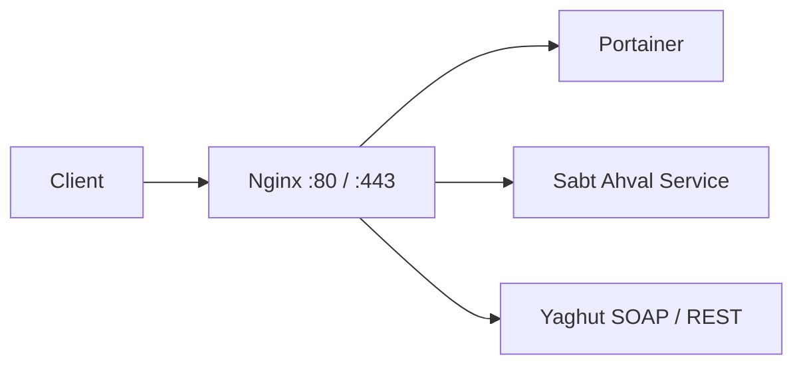

---
title: یادداشت‌های عملیاتی جاوا، Nginx، Docker و SSL
tags:
  - java
  - nginx
  - docker
  - ssl
  - openssl
  - linux
  - wso2
  - webflux
  - swagger
  - troubleshooting
aliases:
  - Java DevOps Notes
  - Nginx SSL
  - SSL در Java
created: 2026-08-25
---

# یادداشت‌های عملیاتی جاوا، Nginx، Docker و SSL

> [!summary]
> این یادداشت مجموعه‌ای از راه‌حل‌های کاربردی برای مسائل پرتکرار در پروژه‌های جاوا است؛ از پیمایش `ArrayList` و تنظیم Reverse Proxy با Nginx تا مدیریت Certificate، Docker، رفع خطای SSL در Java، WSO2 و Swagger در WebFlux.

---

## فهرست مطالب

- [[#پیمایش ArrayList و تبدیل آرایه به List در جاوا]]
- [[#مسیر‌دهی درخواست‌ها با Nginx Reverse Proxy]]
- [[#تبدیل فایل CER به CRT در لینوکس]]
- [[#پیکربندی SSL در Nginx برای APIM]]
- [[#استخراج Key و Certificate از PFX]]
- [[#اجرای Nginx با Docker]]
- [[#دیکامپایل JAR با CFR]]
- [[#پاک‌سازی لاگ Containerهای Docker]]
- [[#اتصال با SSH Tunnel از طریق sshuttle]]
- [[#تنظیم DNS در لینوکس]]
- [[#بررسی ناسازگاری Role و Permission در WSO2]]
- [[#رفع خطای PKIX path building failed در Java]]
- [[#راه‌اندازی Swagger برای Spring WebFlux]]
- [[#نکات امنیتی و بهترین شیوه‌ها]]

---

# پیمایش ArrayList و تبدیل آرایه به List در جاوا

فرض کنید یک سرویس SOAP یا Remote، آرایه‌ای از `InstitutionBean` برمی‌گرداند:

```java
InstitutionBean[] bankInfos = bankResponseBean.getInstitutions();
```

می‌توان این آرایه را با حلقه `for-each` به `ArrayList` تبدیل کرد:

```java
List<InstitutionBean> bankInfoList = new ArrayList<>();

for (InstitutionBean bankInfo : bankInfos) {
    bankInfoList.add(bankInfo);
}
```

نمونه کامل‌تر:

```java
public GetInstitutionsResponse getInstitutions(
        String yaghutSession,
        Long length,
        Long offset
) throws RemoteException {

    GetInstitutionsResponse response = new GetInstitutionsResponse();

    ContextEntry[] context =
            YaghutUtil.createYaghutSessionContext(yaghutSession);

    InstitutionRequestBean request = new InstitutionRequestBean();
    request.setLength(length);
    request.setOffset(offset);

    InstitutionsResponseBean remoteResponse =
            yaghutBpmsProxy.getInstitutions(context, request);

    response.setCount(remoteResponse.getTotalRecord());

    InstitutionBean[] institutions = remoteResponse.getInstitutions();

    List<InstitutionBean> institutionList =
            new ArrayList<>(institutions.length);

    for (InstitutionBean institution : institutions) {
        institutionList.add(institution);
    }

    response.setInstitutionsList(institutionList);

    return response;
}
```

## روش کوتاه‌تر با `Arrays.asList`

اگر فقط به یک `List` نیاز دارید:

```java
List<InstitutionBean> institutionList =
        new ArrayList<>(Arrays.asList(institutions));
```

یا با Stream:

```java
List<InstitutionBean> institutionList = Arrays.stream(institutions)
        .toList();
```

> [!warning]
> خروجی `Arrays.asList(...)` اندازهٔ ثابت دارد و نمی‌توان با `add` یا `remove` آن را تغییر داد.  
> اگر به لیست قابل‌تغییر نیاز دارید، آن را در `new ArrayList<>(...)` قرار دهید.

> [!tip]
> متغیر `i` در نمونه اولیه افزایش پیدا می‌کرد اما استفاده‌ای نداشت؛ بهتر است حذف شود.

---

# مسیر‌دهی درخواست‌ها با Nginx Reverse Proxy

**Nginx** می‌تواند درخواست‌های ورودی را بر اساس مسیر URL به سرویس‌های داخلی یا خارجی هدایت کند.



نمونه پیکربندی:

```nginx
server {
    listen 80;
    server_name smartideanginx;

    access_log /var/log/nginx/access.log;
    error_log  /var/log/nginx/error.log debug;

    # Portainer
    location /100app31/ {
        rewrite ^/100app31(/.*)$ $1 break;

        proxy_pass http://portainer:9000/;
        proxy_set_header Host $host;
        proxy_set_header X-Real-IP $remote_addr;
        proxy_set_header X-Forwarded-For $proxy_add_x_forwarded_for;
        proxy_set_header X-Forwarded-Proto $scheme;
    }

    # سرویس ثبت احوال
    location /ctx/gw/sabteahval/ {
        proxy_pass https://gservices.nix.gov.ir/ctx/gw/sabteahval/;

        proxy_set_header Host gservices.nix.gov.ir;
        proxy_set_header X-Real-IP $remote_addr;
        proxy_set_header X-Forwarded-For $proxy_add_x_forwarded_for;
        proxy_set_header X-Forwarded-Proto $scheme;
    }

    # Yaghut REST
    location /yaghut/rest/bimBIM/ {
        proxy_pass https://172.16.19.143/yaghut/rest/bimBIM/;

        proxy_ssl_verify off;
        proxy_ssl_server_name on;
        proxy_ssl_name 172.16.19.143;

        proxy_set_header Host 172.16.19.143;
        proxy_set_header X-Real-IP $remote_addr;
        proxy_set_header X-Forwarded-For $proxy_add_x_forwarded_for;
    }

    # Yaghut SOAP
    location /yaghut/soap/ {
        proxy_pass https://172.16.19.143/yaghut/soap/;

        proxy_ssl_verify off;
        proxy_ssl_server_name on;
        proxy_ssl_name 172.16.19.143;

        proxy_set_header Host 172.16.19.143;
        proxy_set_header X-Real-IP $remote_addr;
        proxy_set_header X-Forwarded-For $proxy_add_x_forwarded_for;
    }
}
```

## نکته مهم درباره `proxy_pass`

وجود یا نبود `/` پایانی در `proxy_pass` روی URL ارسالی به سرویس مقصد اثر می‌گذارد.

مثال:

```nginx
location /api/ {
    proxy_pass http://backend/;
}
```

درخواست زیر:

```text
/api/users
```

به این مسیر ارسال می‌شود:

```text
http://backend/users
```

اما در حالت زیر:

```nginx
location /api/ {
    proxy_pass http://backend;
}
```

مسیر کامل حفظ می‌شود:

```text
http://backend/api/users
```

> [!warning]
> `proxy_ssl_verify off` بررسی اعتبار گواهی SSL مقصد را غیرفعال می‌کند. این گزینه فقط برای محیط داخلی، گواهی Self-Signed یا شرایط موقت مناسب است؛ در Production بهتر است CA معتبر تنظیم شود.

---

# تبدیل فایل CER به CRT در لینوکس

پسوندهای `.cer` و `.crt` لزوماً تعیین‌کننده فرمت واقعی Certificate نیستند. ممکن است فایل در قالب **DER** یا **PEM** باشد.

اگر فایل `.cer` در قالب DER باشد:

```bash
openssl x509 -inform DER \
  -in certificate.cer \
  -out certificate.crt
```

برای تشخیص فرمت فایل:

```bash
file certificate.cer
```

نمایش اطلاعات Certificate:

```bash
openssl x509 -in certificate.crt -text -noout
```

اگر فایل از قبل PEM باشد، معمولاً فقط تغییر پسوند کافی است:

```bash
cp certificate.cer certificate.crt
```

---

# پیکربندی SSL در Nginx برای APIM

نمونه فایل `nginx.conf` برای قرار گرفتن Nginx جلوی API Manager:

```nginx
user nginx;
worker_processes auto;

events {
    worker_connections 1024;
}

http {
    include mime.types;
    default_type application/octet-stream;

    access_log /var/log/nginx/access.log;
    error_log  /var/log/nginx/error.log;

    server {
        listen 443 ssl;
        server_name api.example.com;

        ssl_certificate     /etc/nginx/ssl/certificate.crt;
        ssl_certificate_key /etc/nginx/ssl/privkey.key;

        ssl_protocols TLSv1.2 TLSv1.3;
        ssl_ciphers HIGH:!aNULL:!MD5;

        location / {
            proxy_pass https://10.254.5.31:8243/;

            proxy_ssl_server_name on;
            # proxy_ssl_verify on;

            proxy_set_header Host $host;
            proxy_set_header X-Real-IP $remote_addr;
            proxy_set_header X-Forwarded-For $proxy_add_x_forwarded_for;
            proxy_set_header X-Forwarded-Proto $scheme;
        }
    }
}
```

تست اعتبار پیکربندی:

```bash
nginx -t
```

بارگذاری مجدد تنظیمات:

```bash
nginx -s reload
```

یا در سیستم‌های مبتنی بر systemd:

```bash
sudo systemctl reload nginx
```

> [!important]
> مقدار `server_name` باید با دامنه‌ای که کاربران استفاده می‌کنند هماهنگ باشد. همچنین Certificate باید برای همان دامنه یا Wildcard معتبر صادر شده باشد.

---

# استخراج Key و Certificate از PFX

فایل‌های `.pfx` یا `.p12` معمولاً شامل Certificate، Private Key و گاهی Certificateهای میانی (Intermediate) هستند.

## استخراج Private Key

```bash
openssl pkcs12 \
  -in certificate.pfx \
  -nocerts \
  -nodes \
  -out privkey.key
```

- پسورد فایل PFX را وارد کنید.
- گزینه `-nodes` باعث می‌شود Private Key خروجی بدون رمز باشد.

> [!danger]
> فایل `privkey.key` بسیار حساس است.  
> آن را در Git قرار ندهید و سطح دسترسی محدود برای آن تعیین کنید:
>
> ```bash
> chmod 600 privkey.key
> ```

## استخراج Certificate اصلی

```bash
openssl pkcs12 \
  -in certificate.pfx \
  -clcerts \
  -nokeys \
  -out certificate.crt
```

## استخراج CA Chain

برای استخراج Certificateهای میانی و CA:

```bash
openssl pkcs12 \
  -in certificate.pfx \
  -cacerts \
  -nokeys \
  -out ca-chain.crt
```

## حذف عبارت‌های اضافی OpenSSL از خروجی

گاهی OpenSSL خطوطی مانند `Bag Attributes` را نیز اضافه می‌کند. برای خروجی PEM تمیزتر:

```bash
openssl pkcs12 \
  -in certificate.pfx \
  -clcerts \
  -nokeys \
  -out certificate.crt \
  -passin pass:YOUR_PASSWORD
```

سپس بررسی کنید فایل شامل بخش زیر باشد:

```text
-----BEGIN CERTIFICATE-----
...
-----END CERTIFICATE-----
```

---

# اجرای Nginx با Docker

نمونه اجرای Container برای Nginx با Mount کردن تنظیمات، گواهی‌ها و لاگ‌ها:

```bash
docker run -d \
  --name my-nginx \
  --restart unless-stopped \
  -p 80:80 \
  -p 443:443 \
  -v /srv/nginx_logs:/var/log/nginx \
  -v /srv/nginx_conf/nginx.conf:/etc/nginx/nginx.conf:ro \
  -v /srv/nginx_cert:/etc/nginx/ssl:ro \
  nginx:stable
```

توضیح Volumeها:

| Volume | کاربرد |
|---|---|
| `/srv/nginx_logs` | نگهداری لاگ‌های Nginx روی Host |
| `/srv/nginx_conf/nginx.conf` | فایل اصلی پیکربندی Nginx |
| `/srv/nginx_cert` | Certificate و Private Key |
| `:ro` | Mount فقط‌خواندنی برای افزایش امنیت |

بررسی لاگ‌ها:

```bash
docker logs -f my-nginx
```

بررسی پیکربندی داخل Container:

```bash
docker exec -it my-nginx nginx -t
```

---

# دیکامپایل JAR با CFR

**CFR** یک Decompiler برای فایل‌های Java `.class` و `.jar` است.

```bash
java -jar cfr.jar myfile.jar --outputdir output
```

| بخش | توضیح |
|---|---|
| `cfr.jar` | فایل اجرایی CFR |
| `myfile.jar` | فایل JAR هدف |
| `--outputdir output` | پوشه خروجی سورس‌های دیکامپایل‌شده |

نمونه برای یک فایل `.class`:

```bash
java -jar cfr.jar MyClass.class --outputdir output
```

> [!note]
> دیکامپایل معمولاً نام متغیرهای محلی، کامنت‌ها و برخی ساختارهای اصلی سورس را بازسازی نمی‌کند. همچنین استفاده از آن باید با مجوز قانونی و مالکیت نرم‌افزار سازگار باشد.

---

# پاک‌سازی لاگ Containerهای Docker

لاگ‌های پیش‌فرض Docker با Driver نوع `json-file` ممکن است فضای دیسک را پر کنند.

برای خالی کردن محتوای لاگ همه Containerها بدون حذف Container:

```bash
sudo sh -c 'truncate -s 0 /var/lib/docker/containers/*/*-json.log'
```

> [!warning]
> در دستور اولیه از کوتیشن‌های هوشمند (`“ ”`) استفاده شده بود؛ در Shell باید از کوتیشن استاندارد `'` یا `"` استفاده شود.

بررسی حجم لاگ‌ها:

```bash
sudo du -sh /var/lib/docker/containers/*/*-json.log
```

## راه‌حل پایدار: Log Rotation

در `/etc/docker/daemon.json`:

```json
{
  "log-driver": "json-file",
  "log-opts": {
    "max-size": "10m",
    "max-file": "3"
  }
}
```

سپس Docker را Restart کنید:

```bash
sudo systemctl restart docker
```

> [!important]
> پس از تغییر تنظیمات Log Driver، معمولاً باید Containerهای موجود را مجدداً ایجاد کنید تا تنظیمات جدید روی آن‌ها اعمال شود.

---

# اتصال با SSH Tunnel از طریق sshuttle

ابزار `sshuttle` امکان هدایت ترافیک شبکه از طریق یک سرور SSH را فراهم می‌کند.

```bash
sshuttle --dns \
  -r parsa@202.133.88.175:2026 \
  0.0.0.0/0 \
  --no-latency-control \
  -D
```

توضیح گزینه‌ها:

| گزینه | کاربرد |
|---|---|
| `--dns` | عبور درخواست‌های DNS از Tunnel |
| `-r user@host:port` | مشخصات SSH Server |
| `0.0.0.0/0` | هدایت تمام IPv4 traffic از Tunnel |
| `--no-latency-control` | غیرفعال‌کردن کنترل تأخیر |
| `-D` | اجرای پس‌زمینه‌ای |

> [!warning]
> هدایت `0.0.0.0/0` یعنی تمام ترافیک IPv4 سیستم از Tunnel عبور می‌کند. اگر فقط به شبکه‌ای مشخص نیاز دارید، Subnet محدودتری وارد کنید؛ برای مثال:
>
> ```bash
> sshuttle --dns -r user@server:2026 172.16.0.0/16
> ```

---

# تنظیم DNS در لینوکس

## تغییر موقت DNS

```bash
echo "nameserver 178.22.122.101" | sudo tee /etc/resolv.conf
```

اما این تغییر در بسیاری از توزیع‌های جدید پس از Restart شبکه یا سیستم از بین می‌رود.

## تنظیم دائمی با systemd-resolved

فایل تنظیمات را باز کنید:

```bash
sudo nano /etc/systemd/resolved.conf
```

بخش زیر را تنظیم یا از حالت Comment خارج کنید:

```ini
[Resolve]
DNS=178.22.122.101
FallbackDNS=1.1.1.1 8.8.8.8
```

سپس سرویس را Restart کنید:

```bash
sudo systemctl restart systemd-resolved
```

بررسی DNS فعال:

```bash
resolvectl status
```

> [!note]
> بسته به توزیع لینوکس، ممکن است مدیریت DNS توسط Netplan، NetworkManager یا systemd-resolved انجام شود. بنابراین تغییر مستقیم `/etc/resolv.conf` همیشه پایدار نیست.

---

# بررسی ناسازگاری Role و Permission در WSO2

در برخی خطاهای Security Manager یا مشکلات Authorization در WSO2، لازم است داده‌های ناقص یا ارجاع‌های شکسته در جدول‌های User Management بررسی شوند.

## یافتن Roleهای نامعتبر

```sql
SELECT um_id, um_role_name, um_tenant_id
FROM um_role
WHERE um_role_name IS NULL
   OR um_role_name = '';
```

## یافتن Permissionهای نامعتبر

```sql
SELECT um_id, um_resource_id, um_action, um_tenant_id
FROM um_permission
WHERE um_resource_id IS NULL
   OR um_resource_id = ''
   OR um_action IS NULL
   OR um_action = '';
```

## یافتن Role Permissionهای دارای Role ناموجود

```sql
SELECT rp.*
FROM um_role_permission rp
LEFT JOIN um_role r
    ON rp.um_role_name = r.um_role_name
   AND rp.um_tenant_id = r.um_tenant_id
WHERE r.um_id IS NULL;
```

## یافتن Role Permissionهای دارای Permission ناموجود

```sql
SELECT rp.*
FROM um_role_permission rp
LEFT JOIN um_permission p
    ON rp.um_permission_id = p.um_id
   AND rp.um_tenant_id = p.um_tenant_id
WHERE p.um_id IS NULL;
```

## یافتن User Roleهای دارای Role ناموجود

```sql
SELECT ur.*
FROM um_user_role ur
LEFT JOIN um_role r
    ON ur.um_role_id = r.um_id
   AND ur.um_tenant_id = r.um_tenant_id
WHERE r.um_id IS NULL;
```

## یافتن User Roleهای دارای User ناموجود

```sql
SELECT ur.*
FROM um_user_role ur
LEFT JOIN um_user u
    ON ur.um_user_id = u.um_id
   AND ur.um_tenant_id = u.um_tenant_id
WHERE u.um_id IS NULL;
```

## بررسی Role خاص

```sql
SELECT *
FROM um_role
WHERE um_role_name = 'Etemad';
```

## افزودن Role در PostgreSQL در صورت نبودن

```sql
INSERT INTO um_role (um_role_name, um_tenant_id)
VALUES ('selfsignup', -1234)
ON CONFLICT DO NOTHING;
```

> [!danger]
> پیش از اجرای `INSERT`، `UPDATE` یا `DELETE` روی دیتابیس WSO2:
>
> 1. از دیتابیس Backup بگیرید.
> 2. Query را ابتدا در محیط غیرعملیاتی بررسی کنید.
> 3. Tenant ID و Schema نسخهٔ WSO2 را دقیقاً کنترل کنید.
> 4. در صورت امکان از ابزارها و مستندات رسمی همان نسخه WSO2 استفاده کنید.

---

# رفع خطای PKIX path building failed در Java

## متن خطا

```text
sun.security.validator.ValidatorException:
PKIX path building failed:

sun.security.provider.certpath.SunCertPathBuilderException:
unable to find valid certification path to requested target
```

## علت

JVM نتوانسته زنجیرهٔ اعتبار Certificate سرور مقصد را تا یک CA مورد اعتماد تأیید کند.

دلایل رایج:

- Certificate سرور Self-Signed است.
- Intermediate Certificateها در سرور ارسال نمی‌شوند.
- Root CA در Truststore جاوا وجود ندارد.
- Certificate منقضی شده یا نام دامنه با Certificate هم‌خوان نیست.
- ارتباط توسط Proxy سازمانی رهگیری و با Certificate داخلی بازامضا می‌شود.

## دریافت Certificate Chain از سرویس مقصد

```bash
openssl s_client \
  -connect gservices.nix.gov.ir:443 \
  -servername gservices.nix.gov.ir \
  -showcerts \
  < /dev/null
```

خروجی بخش‌های زیر را نمایش می‌دهد:

```text
-----BEGIN CERTIFICATE-----
...
-----END CERTIFICATE-----
```

Certificateهای موردنیاز را در فایل‌هایی مانند `server.crt` یا `ca-chain.crt` ذخیره کنید.

## وارد کردن Certificate در Java Truststore

نمونه Dockerfile برای Java 8:

```dockerfile
FROM openjdk:8-jdk-alpine

ARG JAR_FILE=SmartIdeaPlatform-MicroIntegrator-latest.jar

WORKDIR /opt/app

COPY ${JAR_FILE} app.jar

# فایل CA یا Certificate مورد اعتماد
COPY certum-ca-chain.crt /tmp/certum-ca-chain.crt

RUN keytool \
    -importcert \
    -noprompt \
    -trustcacerts \
    -alias certum_root_ca \
    -file /tmp/certum-ca-chain.crt \
    -keystore "$JAVA_HOME/jre/lib/security/cacerts" \
    -storepass changeit

ENTRYPOINT ["java", "-Duser.timezone=Asia/Tehran", "-jar", "app.jar"]
```

> [!important]
> در Dockerfile اولیه، نام فایل کپی‌شده و فایل معرفی‌شده به `keytool` یکسان نبود. در نسخه اصلاح‌شده، هر دو `certum-ca-chain.crt` هستند.

## بررسی وجود Certificate در Truststore

```bash
keytool -list \
  -keystore "$JAVA_HOME/jre/lib/security/cacerts" \
  -storepass changeit \
  -alias certum_root_ca
```

> [!tip]
> به‌جای تغییر Truststore پیش‌فرض Java، می‌توان یک Truststore اختصاصی ساخت و آن را با گزینه‌های زیر به برنامه معرفی کرد:
>
> ```bash
> -Djavax.net.ssl.trustStore=/opt/app/truststore.jks
> -Djavax.net.ssl.trustStorePassword=changeit
> ```
>
> این روش در محیط‌های Production قابل‌کنترل‌تر است.

---

# راه‌اندازی Swagger برای Spring WebFlux

برای مستندسازی APIهای Spring WebFlux می‌توان از **Springdoc OpenAPI** استفاده کرد.

## وابستگی Maven

در پروژه‌های جدید، فقط یکی از Starterهای مناسب نسخهٔ Spring Boot را اضافه کنید. برای Spring Boot 3 و WebFlux:

```xml
<dependency>
    <groupId>org.springdoc</groupId>
    <artifactId>springdoc-openapi-starter-webflux-ui</artifactId>
    <version>3.0.1</version>
</dependency>
```

> [!warning]
> هم‌زمان از وابستگی‌های نسل جدید `springdoc-openapi-starter-*` و وابستگی قدیمی `springdoc-openapi-webflux-ui` استفاده نکنید؛ ممکن است تداخل نسخه ایجاد شود.
>
> وابستگی قدیمی:
>
> ```xml
> <artifactId>springdoc-openapi-webflux-ui</artifactId>
> ```

## پیکربندی اطلاعات OpenAPI

```java
import io.swagger.v3.oas.annotations.OpenAPIDefinition;
import io.swagger.v3.oas.annotations.info.Info;
import org.springframework.context.annotation.Configuration;

@OpenAPIDefinition(
        info = @Info(
                title = "Legal Expert Microservice API",
                version = "1.0",
                description = "This API provides legal expert services."
        )
)
@Configuration
public class OpenApiConfig {
}
```

پس از اجرای برنامه، مسیرهای رایج عبارت‌اند از:

| مورد | آدرس |
|---|---|
| Swagger UI | `/swagger-ui.html` |
| Swagger UI جدید | `/swagger-ui/index.html` |
| OpenAPI JSON | `/v3/api-docs` |
| OpenAPI YAML | `/v3/api-docs.yaml` |

مثال:

```text
http://localhost:8080/swagger-ui/index.html
```

---

# نکات امنیتی و بهترین شیوه‌ها

1. **Private Key را هرگز داخل Repository قرار ندهید.**
2. برای Nginx در محیط Production، بررسی Certificate مقصد را بی‌دلیل غیرفعال نکنید:
   ```nginx
   proxy_ssl_verify on;
   ```
3. از `proxy_ssl_trusted_certificate` برای معرفی CA مورداعتماد به Nginx استفاده کنید.
4. رمزهای عبور PFX، Java Keystore و Docker Registry را در متغیر محیطی یا Secret Manager نگهداری کنید.
5. برای Java، در صورت امکان از Truststore اختصاصی استفاده کنید.
6. پیش از اجرای دستورات تغییردهنده روی دیتابیس WSO2، Backup تهیه کنید.
7. برای Docker Log Rotation تنظیم کنید تا پر شدن فضای دیسک باعث اختلال سرویس نشود.
8. قبل از Reload کردن Nginx همیشه پیکربندی را تست کنید:
   ```bash
   nginx -t
   ```
9. از نسخه‌های سازگار Spring Boot و Springdoc استفاده کنید.
10. در محیط عملیاتی، لاگ Debug در Nginx را فقط برای زمان محدود فعال کنید؛ زیرا حجم لاگ بسیار زیاد می‌شود.

---
# How Restart correct Nginx

correct command for restart nginx:
```
docker compose exec <nginx-service> nginx -t
docker compose exec <nginx-service> nginx -s reload
```
not restart with container restart or compose-restart

---
